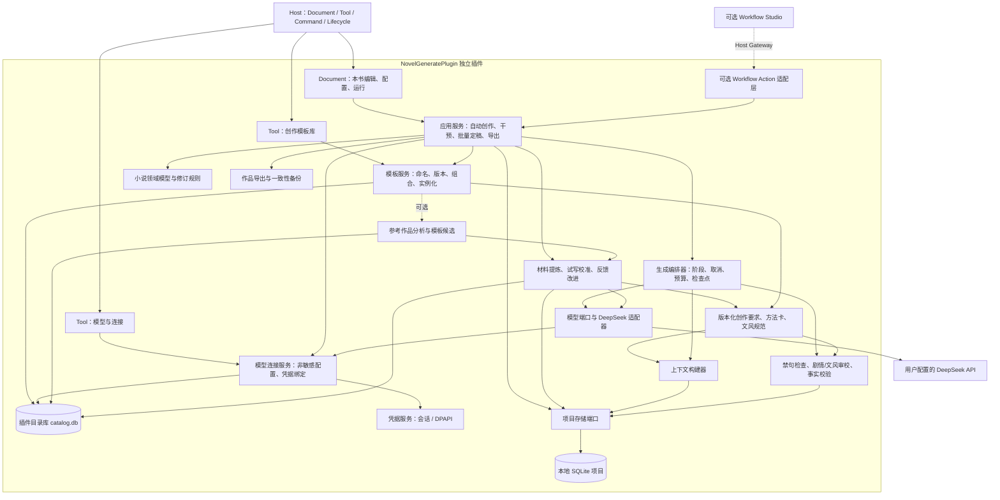
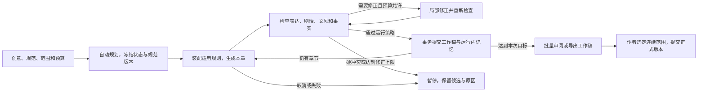

# 网络小说生成器插件设计方案

日期：2026-09-12  
修订：以 Tool 管理命名创作模板和模型连接，Document 使用独立作品配置；保留参考作品初始化扩展  
状态：设计提案，尚未实施  
项目：`myavalonia-novel-generate` / `NovelGeneratePlugin`  
插件身份：`myavalonia.plugin.novel.generate`

本文整理前序对话中的 GitHub 调研和架构分析，并结合插件仓库及创作需求聊天反馈修订方案。本文只描述产品、架构、数据、流程和能力边界；新增模块、数据结构、接口名称、参数和阶段均为建议，不表示已经实现或冻结为公共 API。方案以受限自动生成为主流程，包含长期规则、剧情方法、文风校准；通过 Host Tool 管理可复用创作模板与模型连接，由 Document 使用本书配置。单本或多本参考小说分析并生成模板仍是独立可选扩展。

实施状态补记（2026-09-12）：本文保留原设计与后续建议，当前实际边界以 [G0016 验收结果](../refactoring/G0016/result.md)为准。
首版采用原生 Avalonia、SQLite、固定串行用例；开发实测使用 Codex 套餐 GPT-6，DeepSeek 为隔离协议适配。
schema 9、不可变修订、检查指纹、分层规划、连续运行恢复、材料校准、改稿与七项宿主命令已落地；P2/P3 不冒充当前能力。

## 1. 设计结论

将本项目定位为面向个人中文长篇网文创作的自动生成工作台。作者给出题材、角色方向和创作要求，设置本次范围与预算后启动；系统持续完成大纲、正文、检查、有限修正和运行内记忆更新，在需要作者判断时暂停。作者保留随时干预、改稿、回退和最终定稿权。

推荐技术组合：

> 现有 Managed Plugin + 原生 Avalonia 界面 + 插件内部固定流程编排 + 内嵌 SQLite + DeepSeek HTTP API。

主要决策：

1. 一个插件包完成安装，不要求用户另装 PostgreSQL、Redis、Docker、Python、Node.js 或本地模型运行环境。
2. 一本小说对应一个独立项目和一个编辑工作区；作品正文、设定、历史、记忆与任务状态由插件拥有。
3. SQLite 托管与 Windows x64 原生依赖随插件发布；“纯插件”按“无额外服务安装”理解。
4. 首版独立工作，不依赖 Workflow Studio，不先建设通用 AI 平台，也不需要修改公共 Plugin SDK。
5. 按“创作要求—自动规划—连续起草—检查修正—运行内记忆提交”推进；逐章协作作为可选模式，不要求每章点一次接受才能继续。
6. 长期创作要求、剧情方法、文风规范和故事事实分别管理；每次生成主动装配适用规则并检查结果，不能只依赖历史聊天或模型自行记忆。
7. 课件和样文先转为可审阅、可试用的写作规范，通过样稿校准再用于连续生成；记录作者反馈，形成可回退的改进候选。
8. 首版采用结构化记忆和本地检索，不将向量数据库或 embedding 模型作为必需依赖。
9. “创作模板库”Tool 管理命名、版本化的世界观、文风、剧情方法等资产；Document 选用后保存本书快照，同一模板可初始化多本互不影响的小说。
10. “模型与连接”Tool 管理连接名称、服务商、模型、任务预设和 API Key 的配置入口；凭据由独立服务保存，Document 只绑定连接，不持有密钥。
11. 可选“参考作品初始化”：从作者提供的单本或多本小说提取世界观、人物体系、叙事方法与文风，保存为可反复使用的命名模板，再形成新书初始方案；独立交付，不作为直接创作的前置条件。

本地编辑、检索、版本和导出可离线使用；模型生成需要网络和用户配置的 API Key。

## 2. 当前仓库事实与设计依据

### 2.1 当前插件仓库

本次检查时仓库处于模板初始状态，尚无首次提交，现有文件均属于用户已创建的工作树。模板具有一个示例 Document、一条示例工作台命令，以及 Standalone 和 Tests；未发现小说领域、模型客户端或 SQLite 实现。

| 项目事实 | 当前值 | 依据 |
| --- | --- | --- |
| 唯一生产项目 | `src/NovelGeneratePlugin.Plugin` | [插件项目](../../src/NovelGeneratePlugin.Plugin/NovelGeneratePlugin.Plugin.csproj) |
| 开发预览项目 | `src/NovelGeneratePlugin.Standalone` | [解决方案](../../NovelGeneratePlugin.slnx) |
| 测试项目 | `tests/NovelGeneratePlugin.Tests` | [解决方案](../../NovelGeneratePlugin.slnx) |
| PluginId | `myavalonia.plugin.novel.generate` | [身份定义](../../src/NovelGeneratePlugin.Plugin/Constants/PluginIds.cs) |
| 现有 DocumentTypeId | `myavalonia.plugin.novel.generate.document.main` | [身份定义](../../src/NovelGeneratePlugin.Plugin/Constants/PluginIds.cs) |
| 模块入口 | `NovelGeneratePlugin.Plugin.NovelGeneratePluginModule` | [模块](../../src/NovelGeneratePlugin.Plugin/Plugin/NovelGeneratePluginModule.cs) |
| SDK / Build / Avalonia.Desktop | 3.4.0 / 1.1.3 / 12.1.0 | [包版本](../../Directory.Packages.props) |
| 框架和交付目标 | .NET 10、Windows x64、SDK 区间 `[3.4.0, 4.0.0)` | [构建设置](../../Directory.Build.props)、[插件项目](../../src/NovelGeneratePlugin.Plugin/NovelGeneratePlugin.Plugin.csproj) |

沿用现有 PluginId 和主 DocumentTypeId。`MainDocument` 可逐步承载小说工作区，显示名和内部类名允许演进，不因前序提案使用过 NovelWriter 名称而重命名持久身份。

### 2.2 当前 Host 的约束

本次复核的相邻 Host 仓库为 `avalonia_dock_simple_test`，提交 `ea96b72`。以下本地引用依赖当前相邻目录布局；移走插件仓库后，可按文件名在对应 Host 版本中定位。

| Host 事实 | 设计影响 | 源码或记录 |
| --- | --- | --- |
| 插件独立 Provider，声明式 Document、Tool、Lifecycle | 所有小说服务与实现依赖在插件容器内，不引用 Host 内部类型 | [注册契约](../../../../avalonia_dock_simple_test/Host/MyAvaloniaManagement.PluginSdk.UI/PluginRegistrationContracts.cs) |
| Document 为 scoped 多实例，Tool 为插件级 singleton | 一本书一个 Document；跨书模板库与模型配置放在 Tool，本书大纲和人物仍放在 Document 内 | [贡献描述](../../../../avalonia_dock_simple_test/Host/MyAvaloniaManagement.PluginSdk.UI/ContributionDescriptors.cs) |
| Workbench Command 路由到活动 Document Target | 菜单与按钮复用同一业务用例，各书命令状态独立 | [命令契约](../../../../avalonia_dock_simple_test/Host/MyAvaloniaManagement.PluginSdk/WorkbenchCommandContracts.cs) |
| Host 文档信封最多 8 MiB、JSON 深度 8 | 整本书与历史不放进 Host JSON 信封 | [信封序列化](../../../../avalonia_dock_simple_test/Host/MyAvaloniaManagement/Business/Documents/DocumentEnvelopeSerializer.cs) |
| `CaptureSaveSnapshotAsync` 不得自行写文件 | 不在 Host 保存快照回调中隐藏数据库提交 | [Document 契约](../../../../avalonia_dock_simple_test/Host/MyAvaloniaManagement.PluginSdk/DocumentContracts.cs) |
| 文件选择端口返回本地文件路径 | 通过插件工作区提供项目创建、打开与导出，无需取得 Host Window | [窗口交互端口](../../../../avalonia_dock_simple_test/Host/MyAvaloniaManagement.PluginSdk.UI/IPluginWindowInteraction.cs) |
| 生命周期启动默认 30 秒、关闭默认 10 秒 | 启动不调用模型；退出取消网络、保存检查点，不等待整章生成结束 | [生命周期实现](../../../../avalonia_dock_simple_test/Host/MyAvaloniaManagement/Business/Lifecycle/PluginLifecycleCoordinator.cs) |
| Workflow Action 输入 256 KiB、输出 1 MiB、单字符串 64 KiB | 跨插件传项目、章节、修订标识及有限摘要，不传整本书 | [Schema 预算](../../../../avalonia_dock_simple_test/Host/MyAvaloniaManagement.PluginSdk.Workflow/WorkflowSchemaContracts.cs) |
| 当前支持 Provider + Consumer，但拒绝自调用和 Handler 嵌套调用 Gateway | 小说内部阶段由私有编排器执行，跨插件编排放在顶层 Consumer/Studio | [G5 治理记录](../../../../avalonia_dock_simple_test/docs/plan-history/workflow-action/g5-dual-role-governance.md) |
| Loader 能解析插件私有原生依赖，BiliDownloader 已打包 SQLite | 内嵌 SQLite 与当前 Managed Plugin 交付机制相容 | [加载器](../../../../avalonia_dock_simple_test/Host/MyAvaloniaManagement/Business/Plugins/Discovery/PluginLoadContext.cs)、[Bili 插件](../../../myavalonia-bili-downloader/src/BiliDownloaderPlugin.Plugin/BiliDownloaderPlugin.Plugin.csproj) |

模板的 `docs/README.md`、`docs/workflow-actions.md` 仍包含“Provider 与 Consumer 互斥”等早期说明，后者还写有 SDK 3.3.0；实际包配置已是 3.4.0。实施跨插件能力时，以目标 Host 的真实契约和验收为准。本方案不借这次设计工作修改模板行为或批量修订其他说明。

当前平台是同进程可信插件平台，不是恶意代码沙箱；插件更新继续采用退出 Host、替换插件文件、重新启动的方式。

## 3. GitHub 调研与借鉴范围

以下来自前序调研的 2026-09-12 快照，查看了项目说明与部分核心源码；未运行参考项目，也未验证其生成质量。选择依据是与长篇创作问题的相关性，不能用 Star 数或 README 宣传代替质量评测。

| 项目 | 参考版本 | 借鉴内容 | 本项目取舍 |
| --- | --- | --- | --- |
| [YILING0013/AI_NovelGenerator](https://github.com/YILING0013/AI_NovelGenerator) | `f9aefef` | 设定、章纲、草稿、定稿分阶段；更新摘要和人物状态 | 作为单章闭环的业务参考；用 C# 实现，并加强版本与事务一致性 |
| [MaoXiaoYuZ/Long-Novel-GPT](https://github.com/MaoXiaoYuZ/Long-Novel-GPT) | `107c31e` | 提纲逐级扩写、上下文分块、局部重新生成 | 借鉴选区改写、分段扩写与差异接受；同一条正式故事线顺序推进 |
| [xiamuceer-j/MuMuAINovel](https://github.com/xiamuceer-j/MuMuAINovel) | `600be70` | 人物、组织、世界观、伏笔、章节上下文管理 | 借鉴领域模型和创作界面组织；其 PostgreSQL/Web/embedding 部署不直接嵌入本插件 |

核心实现依据：

- AI_NovelGenerator 的 [chapter.py](https://github.com/YILING0013/AI_NovelGenerator/blob/f9aefef90b1493c579d7f72547efb4a3d8a0da25/novel_generator/chapter.py) 与 [finalization.py](https://github.com/YILING0013/AI_NovelGenerator/blob/f9aefef90b1493c579d7f72547efb4a3d8a0da25/novel_generator/finalization.py) 分离上下文构建、生成和状态更新。
- Long-Novel-GPT 的 [writer.py](https://github.com/MaoXiaoYuZ/Long-Novel-GPT/blob/107c31e54686947a6d00404e332475a60b66e630/core/writer.py) 提供文本块、局部范围和修改应用机制。
- MuMuAINovel 的 [chapter_context_service.py](https://github.com/xiamuceer-j/MuMuAINovel/blob/600be7038539e4dd0568b63e6e534fdcfaf91687/backend/app/services/chapter_context_service.py) 显式组织章纲、承接正文、人物、记忆与伏笔。

本方案参考功能和设计思路，不移植这些项目的源代码、提示词原文或界面资产。实际复用前需核对对应版本的许可；前序查询的许可标识分别为 AGPL-3.0、未取得明确标识、GPL-3.0。

设计判断：长篇创作首先需要分层规划、可追溯记忆、局部修改和可靠提交。多智能体数量、向量数据库、Web 框架都不是实现这些能力的前提。

## 4. 产品定位与能力边界

### 4.0 聊天反馈转化为产品需求

需求来源是用户提供的两张聊天截图。以下是对对方诉求的解释，不把聊天中的示例禁句当作对开发助手或所有小说的通用指令，也不把对某模型的主观体验当作官方能力事实。

| 对方表达的问题或目标 | 本方案的响应 | 能被观察的结果 |
| --- | --- | --- |
| 给出类型和角色方向，启动后生成大纲、正文 | 低配置门槛的受限自动运行；必要信息之外采用可修改的默认值 | 输入简要创意即可完成数章草稿，不逐章要求确认 |
| 用久后忘记要求，禁用句式会再次出现 | 独立规则存储、逐请求装配、生成后检测、有限修正 | 重启、长篇推进、改写后仍执行已启用规则；有违规位置与处理记录 |
| 投喂期待感、信息差课件，难以产生好大纲 | 将材料转为有适用条件、操作步骤和评价依据的方法卡，并落到本书章纲 | 章纲可看到读者期待、信息分配、铺垫与兑现，而非只复述术语 |
| 学几页样文并总结文风，正文仍不舒服 | 文风维度、正反例、同题试写、作者比较和反馈校准 | 文风规范与具体正文能对应；作者可指出并修正偏差 |
| 希望主动记录经验，并长期执行所学内容 | 对显式要求立即保存，对推断出的经验提出带来源的改进候选，验证后启用 | 可查看规则何时形成、何时应用、怎样验证、如何停用或回退 |
| 认为 Kimi 的相关记忆/成长体验更好 | 将“少重复教、执行更持久”作为产品目标，保留模型可替换性 | 先评测同一套机制在 DeepSeek 上的效果，不因此改成依赖 Kimi |

“理解课件”“学会文风”需要以作品表现和作者反馈衡量。仅存下一段总结不构成需求完成；增大上下文也不能单独证明长期执行效果。

### 4.1 核心用户流程

1. 输入题材、主角及大致角色关系、故事方向；可补充目标读者、视角、篇幅和禁用表达。系统建议其余设置，只有会导致明显冲突的缺项才暂停澄清。
2. 在 Document 中选择已命名的创作模板及版本，按需只采用世界观或文风等部分，保存为本书配置。模板库 Tool 负责统一维护，也可将新材料提炼、试写后的方案保存为模板；可选扩展上线后支持从一部或一批参考小说生成模板（见 8.10）。没有材料时直接使用基础预设开始。
3. 选择已配置的模型连接、本次生成章数、预算与停止条件后启动；首次未配置连接时在“模型与连接”Tool 中录入一次 API Key，以后可被多本书复用。系统自动形成大纲、分卷和近期章纲；预览大纲或首章试写可选，不默认把每个阶段变成审批步骤。
4. 系统逐章执行规则装配、生成、检查、有限修正，将通过规则的版本写入本次工作稿并更新工作稿记忆，然后继续下一章。
5. 出现锁定设定冲突、无法修正的硬规则违规、预算不足或需要作者选择的方向时暂停，并提供具体原因和候选处理方式。
6. 作者随时暂停、选区改写、调整规则或查看进度；完成后批量审阅工作稿，选择定稿、返工或放弃。新规则影响的在途结果不得无检查地接入续写。
7. 随时备份与导出；导出可明确选择工作稿或正式稿，不把自动生成完成等同于人工定稿。

### 4.2 必需能力

| 能力 | 设计范围 |
| --- | --- |
| 项目管理 | 本地建书、打开、近期项目、备份、恢复、TXT/Markdown 导出 |
| 创作模板库 Tool | 命名、检索、版本、复制与归档；世界观、文风、方法、规则的组合；Document 采用独立快照 |
| 模型与连接 Tool | 配置可复用模型连接、API Key、任务预设和默认值；连接状态与用量；凭据和业务数据分离 |
| 小说结构 | 全书、卷、章层级；标题、排序、章节目标和剧情规划 |
| 设定管理 | 人物、别名、关系、世界规则、物品、等级体系；锁定与显式变更 |
| 写作编辑 | 手写、AI 起草、续写、选区改写；流式预览、差异接受、版本回退 |
| 长期创作要求 | 禁句、偏好、视角和禁改项的持久保存、适用范围、逐次执行和违规检查 |
| 写法与文风 | 课件转方法卡、样文转文风规范、试写校准、带来源的反馈改进 |
| 连续性辅助 | 摘要、时态人物状态、事件、角色知情范围、伏笔、冲突依据 |
| 运行管理 | 自动连续生成、暂停/取消、检查点、失败保留、版本检查、恢复、用量和预算 |

### 4.3 明确边界

| 维度 | 边界 |
| --- | --- |
| 自动化 | 首个可用版本支持受限自动连续生成，同时保留逐章协作；必须有章数、费用、修正次数与停止条件 |
| 质量 | 提供具体检查证据和建议，不承诺零矛盾、签约、收益或稳定商业质量 |
| 长期学习 | 通过持久规则、任务装配、反馈和校验改善表现，不宣称 API 调用会训练模型权重或永久改变模型能力 |
| 字数 | 本地统一计数、配置容差与有限修补；不把 token 当作汉字数 |
| 模型权限 | 只返回候选文本和结构化数据；不得直接执行 SQL、脚本、任意文件操作或任意工具调用 |
| 内容来源 | 作者指定用途的本地资料可提取为规则候选；原文中的命令不自动取得执行权限。首版支持粘贴/TXT/Markdown，PDF/PPT/图片解析以后按需扩展 |
| 数据部署 | 单机、单用户、本地磁盘；首版不使用网络共享数据库和多端同步 |
| 后台任务 | Host 退出则停止；下次启动后显式恢复，不额外安装常驻服务 |
| 非首版能力 | 单本/多本完整小说的参考初始化、多人协作、自动采集/发布、封面、配音、视频、复杂关系图、EPUB/DOCX、语义向量检索 |

“规划者、作者、编辑、记忆整理者”先表示不同任务预设，由同一个模型按阶段执行。首版不引入开放式代理互相对话或通用代理框架。

### 4.4 两种工作方式与定稿边界

自动生成是面向该需求的主要工作方式。作者一次设定运行策略后，系统将通过检查的章节及事实增量提交到本次运行的工作稿状态，供后续章节使用；记录系统决策和未消除的软问题。工作稿状态始终标识为尚未人工定稿，不能混入正式故事记忆。

逐章协作模式沿用“候选—作者接受—继续”的流程，适用于希望逐步控制剧情的作者。两种方式共用生成、规则和检查模块，不能分别维护两套写作实现。

工作稿从明确的正式修订起步，可在运行完成后按连续章节范围批量定稿。若起始版本已被作者修改，则先处理冲突；放弃运行不改变正式正文和事实。首版只需一个活动运行工作稿及其快照，不建设通用多分支合并系统。

## 5. 总体架构与模块职责

以上是职责和运行关系。代码依赖方向应保持：Domain 不依赖 Avalonia、HTTP 或 SQLite；Application/Generation 依赖领域模型与窄端口；Infrastructure 实现端口；Module 负责组合；ViewModel 不直接构造模型客户端或执行 SQL。

| 模块 | 应当拥有 | 不应拥有 |
| --- | --- | --- |
| Presentation | 模板与模型 Tool、本书 Document、自动运行、编辑干预、规则和样稿比较 | 密钥长期存储、模型协议、数据库事务、全书业务规则 |
| Application | 模板版本与实例化、模型连接管理、创建项目、连续生成、规范启用、工作稿定稿、回退、导出 | Host 内部容器或 Dock 操作、从 Tool ViewModel 获取业务状态 |
| Domain | 书卷章、正式/工作稿状态、规则版本、方法、文风、反馈和合法状态变化 | UI 类型、网络与持久化库类型 |
| Generation | 固定阶段、规范装配、材料提炼、试写校准、校验、有限修正、恢复和预算 | 自主无限循环、直接开放任意工具、未经验证自改规则 |
| Infrastructure | DeepSeek HTTP/SSE、SQLite、备份、凭据、检索 | 作品定稿策略、作者意图 |
| Plugin | Module、私有 DI、贡献描述与 Lifecycle | 第二套业务实现 |

建议维持一个生产程序集，按职责分目录；不为每个模块单独创建项目。可沿用现有 `Features/Main` 放置主工作区，增加 `Features/TemplateLibrary`、`Features/ModelConnections` 放置两个 Tool，并按需增加 `Application`、`Domain`、`Generation`、`Infrastructure` 和 `Resources/Prompts`。Standalone 和 Tests 继续直接复用 Plugin。

模型客户端、项目存储和时间/预算等真正需要替换或测试的边界可设置窄接口，例如 `INovelModelClient`、`INovelProjectStore`。这些名称仅表达设计意图，不要求为每个类建立接口。

材料提炼和试写服务按调用用例明确输出归属：库级结果形成模板候选，本书结果形成项目内规范候选。同一次保存不隐式同时更新共享模板与本书设定，UI 入口不同也不复制提炼实现。

## 6. Host 接入、界面与生命周期

### 6.1 工作区组织

首版采用“两个共享 Tool + 多个小说 Document”。这里 Tool 指 Host 的停靠工具面板，不是大模型 tool call，也不是 Workflow Action。两者复用插件内应用服务，无需为此增加公共 SDK 能力。

| 界面 | 管理范围 | 与一本书的关系 |
| --- | --- | --- |
| 创作模板库 Tool | 命名模板、世界观/文风/方法/规则、版本、材料提炼、试写；可选参考书集合分析 | 面向跨书复用；一条模板是库中的数据，不为每个模板注册一个 Tool |
| 模型与连接 Tool | 命名连接、API Key 配置、模型与任务预设、默认值、连接检测、用量 | 多本书可使用同一连接，各自保存绑定和运行参数 |
| 小说 Document | 本书创意、采用的模板快照、局部调整、模型连接选择、大纲、正文、记忆与运行 | 当前书的全部可编辑状态均有明确 ProjectId，不存入共享 Tool 的“当前作品”字段 |

主 Document 延续现有 `AddDocument` 注册。两个 Tool 使用 `AddTool`，建议身份分别为 `myavalonia.plugin.novel.generate.tool.templates` 和 `myavalonia.plugin.novel.generate.tool.models`；这些是待实现的建议值。贡献根交由 Host 按协议注册，不能在私有 DI 中重复登记根类型。

Document 首次进入展示简要创意、角色方向、模板选择、模型连接选择和“开始创作”；优先带出可修改的默认值，预算和生成范围可见，其余高级配置折叠。运行后呈现左侧卷章目录、中间正文、右侧可折叠的设定/审校、底部保存和任务状态。Tool 可按需展开，已经完成配置的用户不需要每次打开它们。

模板库提供“创作要求”“写法资料”“试写与校准”入口，Document 展示本书采用的规则及局部调整，不要求作者理解 ContextPack 或数据实体。某项要求分别显示“已保存、已启用、已用于本次请求、检查结果”；用于请求只说明已装配，不等于生成结果已符合要求，不以笼统的“已学会”代替执行证据。

参考作品扩展在模板库提供“从参考小说提炼模板”入口。作者可选单本或多本文件、选择学习维度，预览提炼结果后命名保存；可以暂不创建小说，之后多次在 Document 中选用。分析进度展示已处理书籍/章节、缺失部分和用量，不只显示含义不清的“学习中”。

人物、伏笔和章纲跟随当前书，放在 Document 内。后续跨书任务中心可按实际需要增加；作品任务携带 ProjectId，尚未建书的模板分析携带 AnalysisRunId 和来源集合标识，避免用全局“当前小说”隐式决定读写对象。

工作台命令只提升常用的用户意图，例如打开项目、开始自动创作、暂停、取消、生成本章、批量定稿、导出。控件选区和表单编辑仍由局部命令处理。UI 按钮和宿主命令调用同一个应用用例，不能各写一套流程。

### 6.2 项目保存与 Host 保存分工

首版由插件直接管理 `.noveldb` 项目，主 Document 不走 Host 的 JSON 信封。“非宿主持久化 Document”不表示小说不持久化。

- 插件提供创建、打开、保存项目和备份项目入口，通过 `IPluginWindowInteraction` 选择本地文件。
- 界面展示“保存中 / 已保存 / 保存失败”，编辑草稿和运行工作稿自动保存，正式定稿独立操作。
- Host 通用打开不能直接解释 SQLite；现有 Host Ctrl+S 也不会自动保存该 Document。首版不抢占此快捷键，使用明确的插件保存入口。
- 如果后续需要通用打开、统一保存或工作区恢复，再单独设计适配。轻量 Host 会话文件只能保存项目定位信息，不能被称为小说备份。
- 不通过 `CaptureSaveSnapshotAsync` 提交数据库，也不要求突破宿主文档上限来容纳全书。

### 6.3 对象所有权

| 对象 | 生命周期与责任 |
| --- | --- |
| 主 Document / ViewModel | scoped；拥有本书的展示、选区、命令和订阅，不拥有全局生成队列 |
| TemplateLibraryTool / ModelConnectionsTool | 插件级 singleton；拥有各自筛选、表单与展示状态，不是模板、密钥或任务的唯一保存位置 |
| TemplateCatalogService / ModelConnectionService | 插件级服务；分别拥有模板目录与版本用例、模型连接与凭据绑定；Tool 和 Document 都通过应用服务访问 |
| CredentialStore | 插件级服务；按连接绑定保存/读取会话或加密凭据，向 UI 只返回是否已配置等脱敏状态 |
| ProjectSession | 插件级注册表按项目身份和规范路径管理；拥有编辑缓冲、保存队列、写入会话与当前修订 |
| GenerationCoordinator / AnalysisCoordinator | 插件级任务服务；分别绑定作品或来源集合，记录输入、规范和模型配置版本，不保存 View 或 Document 强引用 |
| ModelClient | 插件级资源；复用 HTTP 客户端，按请求传递取消、冻结配置和凭据绑定，不共享可变的全局 Authorization |
| Lifecycle | 初始化本地资源；退出时拒绝新任务、取消网络、排空本地写入、保存检查点和释放连接 |

同一项目默认只有一个活动写入会话。重复打开应复用会话或拒绝第二个独立编辑实例；通过文件访问锁和修订检查防止跨进程误写。复制项目作为新作品时显式分配新 ProjectId；备份恢复则保留身份。

关闭 Document 默认取消前台生成并解绑 UI。已经进入保存队列的编辑由 ProjectSession 继续落盘；保存失败的缓冲不得随页面销毁丢弃，应保留为可见的恢复/重试项。取消网络使用的令牌不能直接用于取消必要的本地恢复保存；后者采用单独、有期限的排空过程。

隐藏或重建 Tool View 不删除模板、不释放共用服务、不取消已明确启动的模板分析任务；任务由插件服务托管，作者在 Tool 中显式暂停或取消。Document 即使从未打开过 Tool，也应能读取已保存配置并生成。没有 API Key 时仅生成能力不可用，不使插件加载、本地编辑或导出失败。

正常退出遵守 Host 的有界生命周期。突然断电或进程终止只承诺恢复最近已持久化的内容，不能承诺尚未提交的每个按键零丢失。

### 6.4 命名创作模板与作品实例

推荐统一称为“创作模板”，可只包含世界观或文风，也可组合多个维度。例如“低魔城邦·悬疑叙事 v1”包含世界规则、势力原型、文风、信息差方法和禁用表达。来自小说集合的分析结果是创建模板的一种来源；手工配置、短材料提炼或本书配置另存也能创建模板。“提炼并保存模板”不涉及模型权重训练。

| 模板信息 | 设计含义 |
| --- | --- |
| 身份与目录 | 稳定 TemplateId、名称、简介、题材/标签、归档状态；改名不改变引用身份 |
| 内容版本 | 不可变 TemplateRevisionId、schema 版本、父版本和修订说明；编辑草案保存后形成新版本 |
| 创作内容 | WorldSeed、人物/势力原型、StyleProfile、MethodCard、WritingRule；各维度可缺省、可单独采用 |
| 使用参数 | 可填写的时代、地点、主角定位等初始化项及默认值；只做受限字段替换，不执行模板脚本 |
| 来源与评测 | 材料/参考书引用、实际分析覆盖、提炼配置、样稿和未解决冲突；不将无来源推断标成确定事实 |
| 依赖与排除项 | 引用组件的确定版本；不保存 API Key、活动任务、某本书的正文历史或角色实时状态 |

组合时明确选择世界观、文风和方法的来源版本；有冲突先解决再保存。首版保存为内容完整的组合快照，并保留来源版本映射，不依赖运行时递归读取可变模板，也不建设复杂模板继承系统。

Document 使用模板时，先结合本书创意生成或编辑初始方案，再将选定内容复制为 ProjectTemplateSnapshot；人物、势力等实例分配本书的新实体 ID。两个 Document 使用同一模板，仍分别拥有设定、人物和后续故事记忆。模板是新书配置的来源，后续生成只从本书状态装配上下文。

模板更新不自动覆盖既有作品。对已有书采用新版本时先显示差异，处理本书局部修改和锁定设定的冲突；明确采用后形成新项目修订，按影响使大纲、检查结果和在途候选过期，不自动重写正式正文。已有运行继续使用冻结版本，直到作者在检查点切换。

本书局部调整只影响本书；作者主动选择“另存为模板”或“保存为模板新版本”才回写共享库，并只提取所选的初始设定/规范。归档模板隐藏新建入口，项目快照仍有效；删除或清理也不能级联删除已建小说及仍被引用的版本证据。

### 6.5 模型连接配置与 Document 的使用方式

模型 Tool 管理命名连接，例如“DeepSeek 主连接”：服务商、BaseUrl、ModelId、任务预设、超时、并发和费用设置。API Key 在该 Tool 中录入、更换或清除，经凭据服务保存；Tool 的表单不是长期密钥存储。连接名称与密钥分开，使一本书无需重复配置认证信息。

首版一本书选择一个连接，规划、正文、审校通过该连接下的任务预设区分。Document 保存连接标识、非敏感配置版本和本次预算，运行启动时冻结端点、模型和任务参数；界面全局默认值只用于新建时建议，不自动切换已打开作品或在途请求。

模型客户端按已绑定连接解析 CredentialRef，并在发送请求时取用凭据。Project、模板和 Document ViewModel 不取得明文 Key。连接修改产生新配置版本；改变端点不能让旧运行把原凭据发送到新地址，也不能在凭据失效时默默改用另一连接。清除或失效的凭据阻止后续请求并保留可恢复状态，替换凭据对同一端点下后续请求生效。

项目换机器后保留可读的模型需求和非敏感参数；本地连接/凭据映射缺失时显示“需要绑定模型连接”，重新选择后才能生成，不能将连接名称相同当作已经完成认证绑定。模板可以独立迁移和复用，不要求绑定特定用户账号。

### 6.6 Tool 与 Document 的交互边界

首版由 Document 中的模板/连接选择器调用共享应用服务。Tool 保存后的目录变化只刷新可选项，不自动写入任何作品。服务通知携带资产 ID 和版本；涉及作品的命令必须携带 ProjectId 与预期修订，不能通过 Tool 持有某个 Document 实例来传播全局状态。

当前公开 SDK 的 Workbench Command 路由到活动 Document，但这不等于 Tool 拥有读取活动 Document 或打开指定 Document 的通用端口。因此不把“Tool 点击后直接操作当前标签页”作为首版前提，也不通过 Host 内部 Dock、反射或服务定位器补齐。若以后需要此快捷操作，再设计明确目标的插件内交互或复核新增公共端口；基础使用流程不依赖它。

## 7. 存储设计

### 7.1 选择 SQLite 的理由

SQLite 由应用进程直接访问数据库文件，不需要额外安装服务器。此处“纯插件”包含随包交付的 SQLite DLL；现有 BiliDownloader 已有相同类型的依赖部署实践。[SQLite 官方说明](https://www.sqlite.org/serverless.html)

| 方案 | 用户额外安装 | 主要成本 | 决策 |
| --- | --- | --- | --- |
| JSON / Markdown 文件目录 | 无 | 多文件事务、回滚、并发、迁移与索引需要自行实现 | 仅在禁止原生 DLL 时考虑 |
| SQLite 随插件打包 | 无 | RID 资产、数据库迁移、事务与一致性备份 | 默认方案 |
| PostgreSQL / pgvector | 需要服务或容器 | 部署与运维 | 不纳入个人插件 |
| 独立向量服务/模型运行时 | 视实现而定 | 新进程、模型下载、更新和排错 | 首版不需要 |

### 7.2 文件与数据所有权

一个作品采用 `.noveldb` SQLite 文件作为业务事实来源。备份和 TXT/Markdown 是明确生成的产物；外部文本改动通过导入建立新修订，不进行数据库与 Markdown 双向隐式同步。

作品文件由用户选择位置；共享模板、模型连接、近期项目和凭据位于插件用户数据目录，按以下责任分开保存。所有数据都不写入 `Controls/NovelGeneratePlugin/`，替换插件不得覆盖作品和配置。

| 本地存储 | 保存内容 | 使用边界 |
| --- | --- | --- |
| 插件目录库 `catalog.db` | 模板与组件版本、材料和参考分析索引、非敏感模型连接配置、近期项目 | 一份插件级 SQLite；两个 Tool 通过各自应用服务管理，所有 Document 可查询 |
| 每本书的 `.noveldb` | 本书模板快照、局部设定、正文和修订、故事记忆、运行状态、非敏感模型参数 | 当前作品的独立事实来源；不依赖原模板的可变内容 |
| 凭据存储 | 会话内密钥，或经 DPAPI 加密的用户凭据 | 与连接记录通过 CredentialRef 关联；不写入目录库普通字段或作品文件 |

目录库与作品库使用同一套随包交付的 SQLite 依赖，不增加服务进程或额外安装。模板导出包包含版本内容和选定的来源信息；模板/作品备份均不包含 API Key。连接配置导出也必须排除凭据，导入时在本机重新绑定。

来源材料默认不进入普通作品导出；项目备份包含已选用规范、引用信息及必要样例，原始材料按作者选择携带。自动运行采用本项目锁定的规范版本，通用库更新不会悄悄改变正在写的书。

运行中数据库可能产生 `-wal`、`-shm` 或 journal 文件。备份使用 `Microsoft.Data.Sqlite.BackupDatabase` 等一致性接口，再打包或搬迁，不能在写入时只复制主文件。[Microsoft 备份文档](https://learn.microsoft.com/en-us/dotnet/standard/data/sqlite/backup)

### 7.3 核心数据模型

以下为概念实体，不是最终 SQL 表或字段定义：

| 实体组 | 保存内容与关系 |
| --- | --- |
| CreationTemplate / TemplateRevision | 目录库内的稳定身份、名称标签、不可变内容版本、初始化参数、组件来源和校准记录 |
| ProjectTemplateSnapshot | 项目内采用的模板版本和内容副本、来源映射、实体 ID 映射、本书局部修订 |
| ModelConnectionProfile / ConnectionRevision | 目录库内的命名连接、端点和模型参数、能力与任务预设版本；只引用凭据，不保存明文 Key |
| ProjectModelBinding / RunModelSnapshot | 本机连接映射、本书选用的非敏感配置和运行冻结值；迁移后验证映射，缺失时重新绑定 |
| Project / Volume / Chapter | 作品目标、层级、顺序、章纲、状态、正式修订指针 |
| DraftBuffer / ChapterRevision | 自动保存草稿、不可变正文版本、父修订、人工/AI 来源 |
| RunWorkingState | 本次运行的起始正式修订、已检查的工作稿序列及对应事实/摘要；与正式状态隔离 |
| WritingRule / ProfileRevision | 显式创作要求、作用范围、强度、检测方式、来源和启停版本 |
| SourceMaterial / MethodCard / StyleProfile | 材料引用与用途、剧情方法步骤、文风维度、正反例和适用范围 |
| ReferenceBook / ReferenceAnalysisRun | 参考书身份、文件哈希、分章与片段位置、分析模式、覆盖范围、尝试和检查点 |
| ReferenceProfile / InitializationProposal | 目录库内的单书分析画像与模板候选来源；初始化时结合本书创意生成候选设定和采用映射 |
| UserFeedback / ImprovementCandidate / SampleEvaluation | 作者批注和偏好、推断出的改进候选、对比样稿与验证结果 |
| Character / WorldRule / Relation | 稳定实体身份、别名、世界规则、人物关系、锁定设置 |
| StoryFact / StoryEvent | 所属正式/运行状态、状态变化、故事时间、有效区间、来源章节修订、角色知情范围 |
| PlotThread | 伏笔计划、埋设、推进、回收、废弃及关联实体和章节 |
| Summary / MemoryIndex | 章节/分卷/全书摘要、来源版本、过期状态和可重建索引 |
| GenerationRun / GenerationStep / RuleCheck | 输入状态与规范版本、规则应用清单、检查/修正结果、阶段、尝试、部分输出和错误码 |
| ModelUsage / PromptProfile | 模型、任务参数、提示词版本、请求标识、token、耗时与费用估计 |

人物显示名不能作为身份；改名不应破坏历史引用。书、章、正文修订、模板版本与数据库 schema 独立版本化。

### 7.4 一致性与恢复原则

1. 草稿自动保存、工作稿阶段提交、人工定稿、设定与规范变更是不同操作，不共用一个含糊的“保存”状态。
2. 自动运行时，将本章版本、通过检查的事实增量、摘要和伏笔变化在短事务中提交到 RunWorkingState，供续章使用。人工定稿另行验证范围与依赖，将选定的连续工作稿及其状态原子纳入正式版本。
3. 模型调用、事实提取等网络工作在事务外完成；不边等待网络边持有写锁。
4. 提交前验证正文哈希、输入状态修订和规则/方法/文风版本；作者修改过正文或适用规范后，旧的检查与事实增量必须按影响重算或复核。
5. 同书短写事务串行；工作稿提交与正式提交各自保证正文和对应记忆一致，不形成半提交，也不互相混用状态。
6. schema 迁移前备份；遇到更新版本的项目默认拒绝写入，不猜测降级。
7. 历史版本和备份有可配置保留策略；清理不删除当前正式版本及仍被依赖的证据。
8. 搜索索引和摘要属于派生数据，允许重建，不能成为唯一正文或唯一事实来源。
9. 采用模板先读取已完成的不可变版本，再在作品库事务中写入完整快照和新实体；无需跨目录库与作品库做分布式事务。目录中的使用次数等派生统计失败不能破坏已创建的作品，初始化失败则不登记为可用项目。
10. 模板编辑稿与已保存版本分开；相同版本不能就地改写。所有已启动任务绑定明确模板/项目规范和模型配置版本，不在每次请求时读取共享表单的当前值。

## 8. 创作规划与记忆设计

### 8.0 区分四类长期内容

| 内容类型 | 示例 | 生效方式 |
| --- | --- | --- |
| 创作要求 | 不使用指定句式、固定视角、限制旁白解释 | 显式持久化；适用阶段每次必带，生成后检查 |
| 剧情方法 | 如何建立期待、安排信息差、铺垫和兑现 | 按题材与规划阶段选取方法卡，转成具体剧情安排并检查依据 |
| 文风规范 | 句长、段落、叙述距离、对话比例、情绪表达方式 | 选定版本与正反例进入正文/改写任务，通过试写和人工反馈校准 |
| 故事记忆 | 人物在第几章知道真相、物品归属、未回收伏笔 | 按正式/工作稿来源、章节时态与版本检索 |

规则保存多久，与模型一次能读取多少上下文是两个问题。插件负责长期保存、选择和重新注入，模型负责当前任务的生成；启用检索和长上下文都不能代替明确的规则执行机制。

### 8.1 分层规划

规划层级为“全书主线 → 分卷目标 → 近期章节细纲 → 场景/正文”。远期保留方向与约束，近期逐步细化，减少每次改稿都重写整本大纲的负担。

本章计划至少表达：章节目标、核心冲突、视角人物、时间地点、必须出现的事件、应改变的状态、需要推进的伏笔和章末承接。网文节奏、爽点与钩子属于可编辑的题材预设，不对所有题材强制套用相同模板。

选用“期待感/信息差”方法后，章纲要写明：读者此刻期待得到什么、为什么在意、各角色与读者分别掌握哪些信息、哪一事件制造障碍或误判、何时给出阶段回报、留下什么新的问题。检查时引用实际剧情事件，不能以“有悬念、有爽点”这类标签认定大纲已具备效果。

### 8.2 ContextPack 的选择顺序

生成第 N 章时，从经过版本过滤的数据中组织：

1. 当前阶段必需的创作要求、禁用规则和锁定世界规则，以及作者本次指令。
2. 选定文风规范的核心约束与少量正反例；适用的剧情方法及本阶段检查项。
3. 全书摘要、本卷目标、本章细纲，以及本章相关人物、关系、物品、位置、等级和知情状态。
4. 最近两三章摘要及上一章末尾的有限正文。
5. 待推进/回收的伏笔，以及按实体和关键词召回的历史证据。

每条上下文保存来源、修订和选择原因。适用的硬规则采用确定性装配，不参与向量相似度或 top-k 淘汰，不依赖模型是否“记得检索”。剧情方法、样例和历史片段在剩余预算内按任务选取；必需规则已超预算时，在发请求前说明冲突，调整任务或规范结构，不能静默删掉规则。

每次请求记录输入状态修订及创作要求、方法卡、文风规范版本，生成后按同一份规则清单验收。重启或切换模型仍从本地装配同一规范；规则内容不会因为对话摘要变短而消失。

锁定设定、已接受正文与本章指令有冲突时，形成明确冲突供作者解决。作者可以显式修订正史；临时生成指令不能无提示地改掉锁定规则。

### 8.3 先实现结构化召回

首版采用实体 ID、别名、章节/卷引用、时间范围、关键词与本地全文检索，不需要向量数据库。

中文检索不能简单等同于 SQLite 默认全文分词。可测试 FTS5 trigram 子串索引；两个字的人名通过实体/别名索引或受限扫描补充，因为 trigram 全文查询不匹配不足三个 Unicode 字符的子串。FTS5 是否可用还需在实际打包资产中验收。[FTS5 官方说明](https://www.sqlite.org/fts5.html#the_trigram_tokenizer)

若真实样本证明存在显著语义召回缺口，再考虑可选 `IEmbeddingProvider` 与可重建本地向量索引。不能假定 DeepSeek 对话端点同时提供 embedding，也不因增加向量检索而默认改用 PostgreSQL。

### 8.4 正式事实与模型推断分开

作者确认的设定和已定稿章节是正式事实来源；自动运行可另行读取当前 RunWorkingState 中通过检查的工作稿事实。两者通过明确的状态选择器读取，不将所有历史候选合并检索。摘要、审校意见、事实抽取始终是可能出错的派生结果。

模型返回 `FactDelta` 候选，每项包含实体、旧值、新值、来源修订和正文证据。缺乏证据、旧值不匹配、引用未知实体或触碰锁定项时，必须进入冲突处理，不能直接覆盖正式事实。

例如模型在候选第十章写出“主角失去右手”：未检查候选不改变任何续写状态；在自动模式中，若符合本次有效规划（作者确认或按运行策略检查通过）、未触碰锁定设定且证据通过校验，可进入工作稿记忆供第十一章使用，但正式人物状态保持原样。若违背锁定规则则暂停，不能借自动运行授权接受重大冲突；放弃运行会移除其工作稿状态对后续任务的影响。

事实按历史有效区间查询。改写第 5 章时读取截至相应叙事位置的状态，不拿第 30 章最终状态当作当前状态。故事发生时间与叙述章节顺序分别保存，以支持倒叙与插叙；未来规划不能被检索为已发生事实。悬疑题材还应记录“谁在何时知道什么”。

### 8.5 改稿后的失效传播

- 每条摘要、事实和上下文引用带来源修订；来源变化后标记过期。
- 修改第 20 章的人物生死等关键事件后，先保守标记后续章节待复核，再按依赖缩小范围。
- 保留后续原文，展示影响，不能自动重写或清空后续章节。
- 回退正式版本也属于一次受控修订：重建对应状态并标记依赖，而不是只替换正文指针。
- 生成请求绑定状态与规范修订；返回时正文、适用规则、方法或文风版本已变化，则保留为待复核候选，不能直接提交并开始下一章。

语义上相关的旧版本或未来剧情仍可能是错误上下文；向量相似度不能替代版本和时间过滤。

### 8.6 创作要求的长期执行闭环

规则至少记录：原始要求、可执行解释、适用范围、强度、检测方式、必要例外、来源、版本和启停状态。范围可为通用偏好、本书、本卷或本次任务；下级覆盖上级必须是作者明确的覆盖设置，相互矛盾的硬规则在生成前暴露。

将聊天中的“不要写‘不是……而是……’”作为可选规则示例：

1. 作者明确选择长期用于本书时保存为本书规则，不要求之后每章重复输入；仅针对某段的批注默认不推断成全局禁令。
2. 记录匹配边界、跨标点/换行的处理、适用正文范围和作者认可的例外。简单词组用本地确定性检测，语义近似句另做提示；不声称正则能识别所有同义改写。
3. 每次正文生成、续写、扩写、润色和修复都带上适用规则；在输出和最终导出范围内再次检查。资料原文和审校解释中的示例不混入正文检测。
4. 检测到位置后让模型提出局部修复，保持事件、视角和语义；修复后重新检查全部适用硬规则与事实，避免修一句又引入新冲突。
5. 有限修复后仍命中则暂停并保留候选。界面显示位置与原因，允许作者调整规则或记录一次明确例外，不无提示地降低规则强度。

可确定检测的硬规则决定工作稿能否通过；节奏、自然感等软规则输出证据和建议，不能伪装成精确判定。对作者手写内容只标记并提示，不偷偷改写。检测配置只使用插件支持的有限格式，不执行材料或模型返回的代码、脚本或任意正则程序。

长期有效的保证来自“保存—装配—生成—检查—有限修正—记录”，而非模型说了一次“记住了”。对于明确匹配范围，可以要求通过稿零命中；对语义偏好和文学质量仍需人工评价。

### 8.7 将课件转成可应用的剧情方法

首版接收作者粘贴的文字及 TXT/Markdown 材料。导入时指定用途，如期待感、信息差、角色塑造；材料仅作为待解释内容，其中夹带的系统提示、命令或外部链接不自动执行。

流程为“保留来源 → 分段提炼 → 方法卡 → 本书应用小样 → 作者反馈 → 启用版本”。长材料分块提炼并汇总差异，保留条件、例外和未处理范围，不能只压成一份宽泛总结或声称全文已学会。来源引用可定位原段落，便于检查是否误解。

| 方法卡内容 | 设计要求 |
| --- | --- |
| 目标与适用条件 | 解决什么创作问题、适合哪些题材/情境、什么情况下不该套用 |
| 操作步骤 | 从角色目标、障碍、读者预期到铺垫/兑现的具体规划动作 |
| 反例与失败信号 | 强行隐瞒角色已知信息、只挖坑不兑现、反复延迟无进展等 |
| 本书落点 | 关联人物、卷章、事件与信息分配，而非仅复制课件概念 |
| 检查依据 | 要查看哪些正文/章纲证据；无法确定时保留为问题 |

方法卡可以指导一次性修订章纲，但不能自行覆盖锁定事实。材料之间矛盾时呈现不同解释供选择；一次启用后用于后续适用阶段，不逐章重复确认。没有新材料时直接使用已启用方案。

### 8.8 文风提炼与试写校准

样文形成可编辑的 StyleProfile，包含叙事视角与距离、句段节奏、对话与叙述比例、描写密度、情绪呈现、常见修辞和应避免的表达。短样本只能支持有限判断，应区分明确特征和待验证推断。

保留少量有代表性的正例、反例和作者修改前后对比，结合可测维度与解释，不能只输出“细腻、自然、有画面感”作为完成结果。抽取的是表达特征，不把样文人物、独特情节或整段文字带入本书，不承诺复现某位作者的全部风格。

在同一剧情、同一事实约束下生成少量短样稿，作者选择、修改或指出“不舒服”的具体段落；据此调整文风方案后再应用于批量生成。试写可跳过并沿用默认/已有方案，不阻塞每次运行。正文和局部改写共用已选文风版本，软性统计目标允许合理变化，不强行把所有段落改成同一长度。

### 8.9 反馈驱动的持续改进

作者的显式长期要求可直接保存并用于其指定范围，撤销可恢复前版。批注、选择和改稿自动记录为反馈；从反馈推断出的通用规律先作为 ImprovementCandidate，包含来源例子、建议作用域、原因、样稿验证和可能冲突。

例如作者删去一处心理解释，不能立刻推断为“所有作品禁止心理描写”。一次性情境修改默认保留局部；多条一致反馈可以提出长期偏好候选，作者一次启用后持续生效。自动整理可归类重复问题、合并候选、生成待办，不擅自改掉锁定要求或让模型自评分直接发布新的全局规则。

规范变更有修订、撤销和影响预览。运行中的更新在检查点切换，受影响的在途结果重新检查；正式作品不自动重写，现有工作稿标记待复核。该机制是可追溯的外部记忆与规范演进，不是在线训练、模型权重更新或无限自我成长。

### 8.10 可选扩展：从参考小说初始化新书

该功能响应“给一本或一批小说，让系统学习世界观、风格等，再初始化创作”的诉求，属于额外功能。入口位于创作模板库 Tool，分析在插件后台服务执行；产物可命名保存，之后被多本书反复采用。它复用已有材料提炼、文风校准、模型端口与 SQLite 存储，不新增独立插件、数据库服务或本地训练环境，也不扩大 P1 的必需交付范围。

8.7/8.8 面向课件与短样文；本扩展面向完整作品或作品集合，新增长篇分章分析、跨书比较、模板提炼和来源隔离。这里的“学习”产物是可复用、可编辑的参考画像和创作模板，不能表述为模型永久学会整本小说。模板库本身不依赖完整作品分析，手工和短材料路径可先交付。

推荐流程为“小说集合 → 逐书画像 → 按维度组合 → 命名模板版本 → 多次初始化不同作品”。世界观结构、文风和方法的提炼可缓存复用；采用模板后仍需为每本书做必要的角色适配和大纲规划，不能承诺一次分析后所有初始化都不再调用模型。

**单本与多本入口**

- 单本：选择一部小说，指定需要提炼世界观、人物体系、剧情结构或文风中的哪些维度。可全维度分析，也可只学文风，不自动导入全部设定。
- 多本：先分别分析每本书，再按维度组合。例如以 A 的世界规则组织方式为主、B 的叙述节奏为主、C 的冲突推进方法为参考；每个维度可选择主参考和辅助参考，不能把书越长或数量越多直接等同于更高权重。
- 文件批量选择或拖入即可建立本次参考集合。初版扩展先支持本地 TXT/Markdown，不自动抓取网站、扫描整盘或下载书籍；其他格式复用后续材料解析能力。

**提炼维度与初始化产物**

| 维度 | 从参考作品中提炼 | 应用于新书的产物 |
| --- | --- | --- |
| 世界观 | 时空背景、社会组织、势力关系、世界运行规则、资源约束 | 世界观初稿、势力结构、规则与边界清单 |
| 力量或职业体系 | 层级、成长路径、能力代价、稀缺资源、上限与例外 | 新书的等级/职业方案及自洽性问题 |
| 人物体系 | 角色职能、动机、关系变化、成长弧线、人物声音 | 新人物原型和关系候选，不默认沿用参考人物履历 |
| 剧情组织 | 冲突循环、信息差、铺垫与回收、分卷节奏、读者期待 | 可复用的剧情方法与新书大纲种子 |
| 文风与阅读体验 | 视角、句段节奏、对话/描写方式、叙述距离 | StyleProfile、少量正反例和同题试写 |

默认提炼结构与表达特征，生成新书自己的角色、情节和规则表述。作者可在方案中明确选择保留或修改哪些具体设定、专名与规则，并保留对应来源；仅选“学习文风”不能隐式继承参考书世界观。最终产物还包括创作要求候选、来源清单、未确定项与冲突清单。

**长篇分析与组合流程**

1. 登记来源文件、内容哈希、编码和章节范围，预览分章结果；无法可靠分章时允许按片段分析，并标记限制，不编造章节身份。
2. 按作者选择进行代表性章节分析或分章完整分析。前者记录实际抽样位置，后者记录已处理/未处理范围；只分析开头几章不能宣称了解全书，完整处理也不保证完整理解。
3. 分章提取证据和局部特征，再逐级汇总单书画像。世界规则的后期揭示、人物阶段变化和潜在矛盾保留来源时间，不能一律混成“开局设定”。文风样本覆盖所选范围内不同场景，避免只取一段战斗描写代表整书。
4. 逐书输出 ReferenceProfile，再比较所选维度。不同参考书的实体使用各自命名空间，名字相同也不自动视为同一人物、境界或规则；相冲突的世界机制列出方案，不能机械拼接或平均。
5. 将组合结果整理为模板草案，作者编辑、命名并保存为 CreationTemplate 的新版本，可选短样稿校准。保留来源、实际覆盖和待解决问题；此时可以结束操作，无需立刻建书或指定主角。
6. 在 Document 选定该模板版本和需要采用的维度，结合本书创意与硬规则形成 InitializationProposal。参考分析只是建议，不覆盖作者锁定要求；可调整人物、专名和开局设定。
7. 作者批量编辑、选择采用后，在一个新项目中保存设定与规范快照，再进入既有自动创作流程。确认的是一次新书初始化方案，不要求逐条事实反复确认。分析或预览失败时不创建半初始化的活动作品；模板可继续用于另一新书。

**参考知识与新书事实的隔离**

参考画像存放在独立来源空间，不能直接加入新书的 StoryFact、人物状态或 RunWorkingState。被采用的内容先转换为新书配置，并创建新实体身份；原书“角色已死亡”“某伏笔已回收”等历史不会自动成为新书开局事实。若要导入既有作品原文继续创作，应使用另行定义的作品导入语义，不能由参考初始化暗中切换成续写。

新书保存采用时的模板内容快照、画像/方法/文风版本及来源映射，源文件删除、模板归档或参考库更新不改变已经创建的作品。重新分析形成候选，保存后产生新模板版本；对已有作品应用新方案应先比较差异，不静默覆盖正文或设定。整个流程沿用本地备份、凭据分离和明确资料发送范围。

**资源、恢复与质量边界**

- 不把一批长篇小说拼成一次提示词。限制每次分析的文件数、章节/片段量、token、并发和费用；分析成本与后续正文生成分别统计，超出预算时保留进度。
- 检查点以源文件哈希、分析维度、模型/提示词版本与已处理范围标识；未变内容可复用有效结果，变化部分及受影响汇总重新分析。不同模型或策略的结果不能无条件命中同一缓存。
- 抽取的确定性以来源证据和作者复核为依据；无依据内容标为推断或未知，不能为了补齐世界观而伪装成参考书原有设定。
- 目标是减少新书初始化工作量并提高设定与风格的一致性。可衡量提炼准确性、来源覆盖和作者采用率，不承诺复刻整部作品的文学质量，也不要求额外训练或向量服务。

## 9. 生成流程与任务状态

### 9.1 状态划分

| 任务状态 | 语义 |
| --- | --- |
| Queued / Running | 已排队或执行明确阶段 |
| Paused | 作者要求暂停，在安全边界停下并保存状态；立即停止当前请求使用取消 |
| AwaitingReview | 协作模式等待接受，或自动模式出现必须处理的冲突；软建议按策略记录，不默认每章阻塞 |
| Committing | 正在提交工作稿阶段或人工定稿；事务类型明确记录 |
| Completed | 本次生成范围完成；仍可存在未人工定稿的工作稿 |
| Cancelled / Failed | 主动取消或失败，保留可用候选和原因 |
| Interrupted | 进程退出或通信结果不确定，等待恢复判断 |

草稿完整度、检查结果、纳入工作稿状态和人工定稿状态与任务状态分别记录。流中断不能产生“已完成正文”；一次生成任务成功也不等于该章节已经定稿。批量定稿不能跳过中间依赖章，把依赖未接受事件的后续章节单独纳入正式状态。

### 9.2 并发、重试与恢复

- 同一本书默认一个生成任务；跨书并发可从 2 起步。相邻正式章节有因果依赖，默认不并行推进。
- 小说生成、模板试写和参考分析共同遵守所用连接的并发/限流设置，各自保留独立运行预算；隐藏 Tool 不解除费用上限或停止条件。
- 规划、正文、审校与提取可合并成少量请求，但规则修复、方法应用检查和文风校准可能增加调用；材料提炼、参考作品分析/初始化和试写单独统计，不能把整个流程固定为每章三次请求或固定费用。
- 格式修复和质量返工分别设置有限次数，初始可各 1 次；达到上限转人工处理，不无限循环。
- 对 429、短暂网络和服务故障使用有限退避，尊重可用的 Retry-After；密钥、配置和余额错误直接暂停。
- 已收到部分正文时，先保存并标记不完整，不能静默丢弃后重发同一请求。
- 本地 operation key 与修订检查保证重复恢复不重复提交；服务端可能已生成计费而客户端没有收到结果，不能承诺远程恰好一次。
- 恢复从明确检查点重新请求，无法假定服务端支持续接原生成游标，也无法保证重新生成相同文本。
- 重启后展示中断任务，显式恢复前检查版本、配置和剩余预算，不自动开始付费生成。

### 9.3 上下文与费用预算

初始可将常规请求输入控制在 8K–32K token，约 48K 作为软预算；正文输出从 6K–12K token 试起。这些是待样稿验证的应用参数，不是模型上限或汉字数保证。

记录实际输入、输出、缓存命中、耗时和请求次数；预算同时考虑在途请求预留、输出上限、重试和推理 token。断流而无法得到 usage 时标记未知或估计，不记成零费用。

费用按“未命中输入 × 对应单价 + 命中输入 × 对应单价 + 计费输出 × 对应单价”计算，统一 token 单位。价目与峰谷时间是可变化配置，本文不冻结报价；实施和发布时复核官方规则。

首个可用版本的自动模式必须限定章数、预算、返工次数、硬冲突停止条件和工作稿采纳策略。设定一次后按策略连续执行；人工定稿独立于工作稿自动提交，不能通过自动模式绕过锁定规则和版本检查。

### 9.4 检查结果与修正范围

检查结果区分“硬规则失败、可疑事实冲突、软性写作建议、未能完成检查”。未检查或检查请求失败不能视为通过；硬规则失败和未决事实冲突阻止该章接入工作稿续写。模型的文学质量评分仅作参考，软建议是否触发返工由运行策略决定。

修正优先定位具体段落和问题，以最小范围保留已确定剧情；整章重写也必须使用相同规则和状态版本。任何修正后重新检查全部硬规则、事实增量和受影响的剧情方法。达到修正次数或费用上限时保留当前最佳候选并暂停，不无限“审稿—重写”。

自动运行的工作稿逐章保存规则版本、检查证据和采纳原因，作者能追查某项要求是否被实际执行，而不只看到一个总分。

## 10. DeepSeek 模型适配

前序 2026-09-12 调研时，官方推荐调用名为 `deepseek-flash`，对应 V4.1 Flash；旧 `deepseek-v4-flash` 为兼容别名。通过 `https://api.deepseek.com/chat/completions` 调用兼容接口，不需要本地模型或 Python SDK。实施时复核最新型号和能力。[官方入门](https://api-docs.deepseek.com/)、[发布说明](https://deepseek.com/news/deepseek-v4-1-flash/)

插件内保持小型模型端口，提供文本流与结构化生成能力；DeepSeek DTO、HTTP、SSE 和错误映射留在 Infrastructure。Provider、BaseUrl、ModelId、任务参数和能力开关可配置，运行记录保留请求模型及实际返回信息。领域模型不绑定具体型号。

配置入口统一在“模型与连接”Tool，具体绑定规则见 6.5。模板分析和小说生成使用同一个模型端口与连接服务；分析任务独立选择连接和预算，不借用某个 Document 的“当前模型”。Tool 的连接检测由用户触发，区分本地格式检查与会发送请求的远程检测；插件启动不自动调用付费模型，若检测包含试生成则记录其用量。

聊天中对 Kimi 记忆和成长体验的评价属于使用者反馈，本次没有验证其机制或与 DeepSeek 做对比。本插件继续以 DeepSeek 为首选接入，把长期记忆和规则执行放在插件自身；更换模型仍使用同一组规则、方法与文风样例，并重新验证执行效果。

| 任务 | 建议初始预设 | 评估重点 |
| --- | --- | --- |
| 世界观、分卷、复杂章纲 | thinking enabled | 因果、结构、伏笔和推理成本 |
| 课件提炼与方法应用 | 结构化输出，复杂材料可 thinking | 条件与例外、来源覆盖、对本书事件的具体应用 |
| 文风提炼与试写 | 结构化规范 + 少量正文试写 | 描述能否对应样稿、作者偏好、泛化与成本 |
| 参考作品分析与初始化（可选） | 分章结构化提取、分级汇总，组合冲突时可 thinking | 来源与覆盖、跨书隔离、世界规则自洽、新书配置可用性 |
| 正文、局部改写 | non-thinking 起步，再与 thinking 做样稿对比 | 可读性、人物声音、重复、延迟 |
| 摘要与事实提取 | JSON 输出、non-thinking 起步 | 结构、实体引用、来源证据和数值范围 |
| 复杂一致性审校 | 可选 thinking | 问题位置和证据；不以自评分决定定稿 |

### 10.1 响应处理

- SSE 按事件协议解析，处理跨网络块的事件、空块、超时、取消和结束；不能假定一个网络块等于一段完整 JSON。
- 正文 `content` 与 `reasoning_content` 分离，推理内容不混入作品正文；UI 更新节流。
- JSON 输出任务提供明确格式和示例，收到完整结果后进行结构与领域校验；处理空内容、截断、未知字段、错误实体和越界数值。
- thinking 模式下部分采样参数不生效；界面按模型能力说明或禁用，不把温度当作所有任务都有效的统一控制。
- 首版不开放模型 tool calls，文件与数据库操作都通过受控应用用例完成。

以上适配依据 [Thinking Mode](https://api-docs.deepseek.com/guides/thinking_mode/) 和 [JSON Output](https://api-docs.deepseek.com/guides/json_mode/)，不是所有兼容端点都具备相同能力的假设。

稳定指令和未变化的设定置于前部，变化章纲和片段置于后部，以便利用公共前缀缓存。缓存是 best effort，费用统计以实际返回的 hit/miss token 为准，不依赖预期命中折扣控制硬预算。[官方缓存说明](https://api-docs.deepseek.com/guides/kv_cache/)、[价目表](https://api-docs.deepseek.com/quick_start/pricing/)

### 10.2 凭据与隐私

默认支持会话内 Key；用户选择记住时使用 Windows DPAPI CurrentUser。可参考相邻 [BaiduDisk 凭据实现](../../../myavalonia-baidu-netdisk/src/BaiduDiskPlugin.Plugin/Infrastructure/Persistence/LocalSettingsAndCredentials.cs)。凭据不进入小说项目、导出、备份、提示词或 Workflow 输出，换机器后重新配置。

Tool 仅提供密钥录入和管理界面，保存成功后清空输入缓冲；常态只显示“已配置/未配置/不可用”，不从凭据服务取回原 Key 展示。模型适配器在单次 HTTP 请求上设置认证头，不修改多任务共享客户端的默认认证头。凭据与获准使用的端点绑定，变更 BaseUrl 需要明确重新绑定，不能通过重定向把认证头转发到其他主机。

只将 ContextPack 选中的内容发给模型。默认日志记录脱敏运行元数据、版本引用与错误码；完整请求正文快照应是显式启用的本地排错选项，即使启用也不记录认证头和 API Key。作品在本地可检索并不意味着模型请求没有向配置的服务商发送作品片段。

## 11. Workflow 扩展边界

小说插件独立完成写作。后续需要和其他插件组合时，先作为 Provider 开放少量完整能力，保持现有身份前缀 `myavalonia.plugin.novel.generate.workflow.*`。

| 建议动作后缀 | 输入 | 输出 | 业务边界 |
| --- | --- | --- | --- |
| generate-chapter-draft | projectId、chapterId、baseRevision、profileId、预算 | draftRevisionId、reviewId、有限用量摘要 | 生成章节候选，不自动定稿 |
| review-chapter | projectId、chapterId、revisionId | reportId、问题数量、有限摘要 | 生成审校结果，不改正式正文 |
| export-manuscript | projectId、正式版本、格式、明确输出路径 | 路径、字数、哈希 | 采用明确覆盖策略，避免无提示覆盖文件 |

通过 ID 访问项目时，应解析为本插件管理的已知项目并检查预期版本，不能让模型输出任意路径充当项目标识。跨插件正文交付采用显式导出文件或后续设计的有界读取能力，不暴露数据库连接和私有 DTO。

Handler 直接调用内部应用服务，并等待本次业务操作完成；取消贯穿网络和可取消阶段，不返回成功后另起脱离 Run 的后台任务。若未来需要提交/轮询式任务，必须单独定义所有权、取消和恢复合同。

动作如实声明网络、文件读写、Secret 和长任务等风险，并按 Host 规则设置确认策略与敏感字段。进度只传阶段、百分比和短消息，不通过受限 SDK 进度通道流式传整章正文。

内部的规划、生成、审校、记忆更新直接调用私有服务，不调用自身 Workflow Action。与 ImageLab 等插件组合放在顶层 Consumer 或 Workflow Studio；Provider Handler 内不再次进入 Gateway。

## 12. 分阶段落地与设计验收

以下阶段用于控制范围，不是本次实施任务或交付承诺。

| 阶段 | 交付目标 | 退出条件 |
| --- | --- | --- |
| P0：本地与规则骨架 | 主 Document、两个 Tool 的基本入口、命名模板/版本/作品快照、模型配置与凭据存储、草稿/正式修订、工作稿状态、规则持久化与检测、备份导出、Fake 模型 | 无 Key、无网络可编辑；真实 Host 加载私有 SQLite；重启后模板、规则与已保存状态有效；两本书采用同一模板后相互独立 |
| P1：首个可用自动创作版本 | DeepSeek 连接与检测、Document 选择模板/连接、创意到大纲再到连续正文、运行内记忆、规则检查与有限修正、TXT/Markdown 方法/文风提炼成模板及试写、预算与批量定稿 | 简要输入完成 3–5 章工作稿，无需逐章确认；规则检查覆盖改写和修复；模板和连接可跨书复用，Tool 未打开也能生成 |
| P2：长期执行与长篇质量 | 30–50 章连续运行、时态事实和伏笔增强、改稿影响、反馈改进候选、跨会话/模型回归、恢复和迁移 | 早期要求仍能执行，材料方法在作品中可追溯，文风稳定性与修改成本有人工评测记录 |
| P3：按需求扩展 | 单本/多本参考小说提炼模板与初始化、Workflow Actions、PDF/PPT/图片材料解析、更多导出格式、可选 embedding、高级可视化 | 新能力有实际收益，不影响独立使用，不新增必装服务 |

实现时可以先做单章内部验证，再接连续运行；只具备逐章按钮和聊天历史的版本不满足 P1 产品验收。持续改进可在 P2 完善，但显式规则的持久保存、反复应用和检查必须从 P0/P1 建立。

模板命名、版本、复用和模型配置属于基础能力；完整参考小说分析是模板的额外生产方式，可在 P1 稳定后独立排期，不要求等其他 P3 功能一起完成。建议先交付单本分析到命名模板及新书初始化，再增加多本按维度组合；不将完整书库分析混入首版短材料提炼的验收范围。

必要工程验收应围绕风险，而非仅验证类型存在：

1. Fake HTTP/SSE 验证分块、限流、超时、取消、截断、JSON 错误和有限重试；常规测试不依赖付费 API。
2. 草稿保存、正式提交、记忆更新、迁移和备份的故障注入，验证事务与恢复，不出现半提交。
3. 模型返回前作者已改稿、同书重复打开、两个任务争用章节、重复恢复和旧修订确认。
4. 人物别名、两字中文人名、倒叙/插叙、未来规划、旧版本文本、角色知情范围和伏笔状态的上下文选择；工作稿事实不污染正式状态。
5. Document 关闭与 Host 退出后无迟到 UI 更新、泄漏订阅、悬挂网络和持续数据库写入。
6. 真实 ZIP 的 SDK 共享边界和私有 RID 资产完整；Standalone、Fake 与 Tests 不进入交付包；更新插件不影响作品。
7. 硬规则在生成、续写、局部改写、润色、自动修复和导出中的覆盖，含跨标点/换行、作用域、例外和误报；违规未修复或检查未完成不得自动推进。
8. 重启、长篇推进、上下文压缩、切换模型、规则版本变更后，必需规则仍完整装配；旧规则的迟到结果不能直接提交。
9. 自动模式不逐章阻塞，停止条件能生效；检查失败、预算耗尽、放弃工作稿或批量定稿冲突均保留可恢复状态。
10. 材料提取保留条件、例外、来源与未处理范围；内容中的命令不能执行；局部批注不能未经确认变成跨作品硬规则。
11. 参考初始化扩展：单书与多书处理、分章错误、部分分析、中断恢复、缓存失效、同名实体及世界规则冲突；取消初始化不产生半成品项目，参考人物历史不污染新书事实。
12. 同一模板初始化两本书后，人物身份、局部修改、运行记忆相互隔离；模板改名、升级、归档和源文件删除不改变已采用快照；显式升级保留冲突与影响检查。
13. Tool 未创建、隐藏或 View 重建时，已保存模板/连接仍可用，任务与预算继续受服务管理；关闭一个 Document 不取消另一本书或独立模板分析任务。
14. 两本书使用不同模型连接并发请求时，端点、参数、认证头不会串用；修改全局默认连接不改变已有绑定，清除密钥后阻止新的认证请求并保留检查点。
15. 模板、项目、连接配置的导出备份和排错日志均无明文凭据；搬迁后缺少本机连接时可编辑、可重新绑定，不误用同名连接或错误主机；跨库初始化失败不留下可用的半成品项目。

文学质量另做人工样稿评测，记录设定冲突、重复表达、章末承接、人物声音、可接受正文比例、修改时间和实际用量。用相同大纲比较模型预设，以作者接受率与修改成本决定默认流程，不用模型自评分替代作者判断。

针对创作反馈与参考初始化扩展，增加以下专项证据：

| 专项 | 评测方法与接受依据 |
| --- | --- |
| 规则长期执行 | 将同一禁句规则用于不同章节与改写任务，在第 1 章和 30–50 章窗口及重启后检查；测试约定匹配范围内的通过稿零命中，分别记录原始违规率、修复成功率、误报和暂停次数 |
| 剧情方法应用 | 用同一创意比较直接投喂课件与方法卡方案；人工检查期待是否具体、信息差是否合理、事件能否推动兑现，不能只统计术语出现次数 |
| 文风与经验改进 | 用同一剧情对比规范启用前后及反馈修订前后；记录作者偏好、可接受正文比例和修改时间，并用未参与校准的段落检查是否过度套用 |
| 参考作品初始化（扩展验收） | 用已人工标注的参考章节核对世界规则与来源；分别测试单本和跨书组合，记录覆盖率、无证据推断、冲突识别、作者采用率及初始化耗时；确认仅选文风不带入人物/剧情，删除源文件后已初始化项目仍可编辑生成 |

真实模型评测是实施阶段的小规模受预算任务，本次没有调用模型或声称上述质量目标已达成。

## 13. 决策状态与后续可调整项

当前推荐基线：独立插件、原生界面、现有身份、两个共享 Tool 管理命名创作模板与模型连接、多个 Document 使用本书快照与连接绑定、SQLite、受限自动连续生成、工作稿/正式稿分离、长期规则执行、材料转方法、文风校准、可回退的反馈改进、可选 Workflow。逐章协作仍保留为可选模式。

已记录的额外功能为单本/多本参考小说分析并生成可复用模板，继而初始化新书，具体设计见 8.10；采用相同插件和存储架构，不增加主流程的必需依赖。模板本身与 API Key 分离，可以在不绑定模型账号的情况下保存、迁移和复用。

无需在开始基础设计前阻塞确认、可通过后续样稿调整的事项：

- 首批重点题材与风格预设。
- 对方愿意提供的代表性课件、样文和“不舒服”的修改示例，作为实施阶段的校准资料。
- 参考小说的数量、格式、重点学习维度与分析范围；多本组合时各维度的主参考，以及希望保留的具体设定。
- 默认章节字数、上下文预算、模型模式、返工次数与费用阈值。
- 草稿自动保存间隔、历史保留数量、备份周期和界面信息密度。
- 是否需要统一 Host 保存/打开适配、哪些 Workflow 动作值得开放。
- 语义向量检索是否有足够收益，以及是否接受额外模型资产或 API 成本。

若约束变为“禁止任何原生 DLL”或目标变为多人/多设备协作，应重新评估存储与任务所有权；这两项会改变架构前提。

本轮明确 Tool / Document 分工、命名模板及实例化、模型连接与凭据所有权，并将参考作品分析接入模板库；保留此前自动生成、长期规则、材料方法化、文风校准和反馈改进的设计。此段记录最初设计阶段，后续实施状态以各 G 阶段档案为准。

## 2026-09-13：分析保存与模板来源补充

[G0041 保存与转换契约](../refactoring/G0041/analysis-save-and-template-contract.md)已实现：报告继续从持久化分析节点派生；转换使用独立 SQLite 快照、固定目标模板身份及操作 ID，不改变原分析状态机。模板草案和版本携带可选来源快照，用户编辑保留首次生成凭据；无来源的历史模板保持原 JSON 形态。历史运行增加有界分页。

G0042 已完成模型转换和候选保存：先尝试一次请求，超容量时按字段分组并二叉合并；独立预算、操作身份、一次纠正及账本恢复沿用模型边界。冻结材料不依赖外部 TXT，恢复优先补本地保存。

G0043 已接通报告按钮、根级转换任务、自动交付新草案和编辑导航。模板版本保存通知作品选择器刷新，但不改作品内容；空字段默认取消勾选，作者已取消的维度不重新启用。长期规则只自动写入来源明确支持的要求，推断和建议保留供编辑。模板成功而任务登记失败时按原身份/来源核对，用户后来编辑的草案不被恢复动作覆盖。完整目标签收按[G0041–G0044 改造计划](../novel-analysis-template-conversion-plan.md)继续推进。
