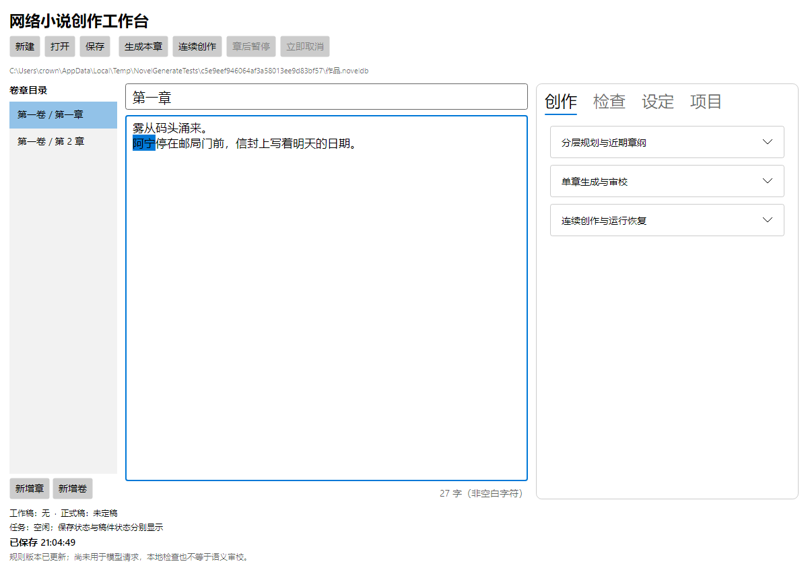

# 网络小说创作工作台产品需求文档

项目：`myavalonia-novel-generate`  
文档版本：v0.2  
编写日期：2026-09-12  
文档状态：首版工程候选已验证；P1 产品验收未完成，未发布  
适用读者：产品负责人、创作者、交互设计、研发与测试

本文依据现有[网络小说生成器插件设计方案](../design/novel-generation-plugin-design.md)，从用户价值、使用流程、功能范围和验收结果整理产品需求。产品展示名暂称“网络小说创作工作台”，不涉及插件身份变更。

截至 2026-09-12，G0001–G0015 的首版工程功能已实现，G0016 已完成工程组合验证。Codex GPT-6 实际连续生成三章工作稿，
487/498/477 字、6 次请求、90187 token，未知用量 0；真实 Host 组合、Scope、View 适配和在途关闭已验证。
作者文学质量签收及完整桌面 Dock/系统文件选择器等交互尚待补充，因此不把工程候选称为已验收或已发布产品。

当前能力与后续路线请结合[验收矩阵](../refactoring/G0016/p1-acceptance-matrix.md)、[使用说明](../usage-guide.md)、
[真实样稿](../refactoring/G0016/samples/rain-letter-working-draft.md)与[已知限制](../refactoring/G0016/known-limitations.md)阅读。
下文用户画像和指标仍是产品假设；P2/P3 能力是后续需求，不表示已经实现。

下面是实际原生工作区的自动化截图（Avalonia Headless/Skia，非完整桌面 Host 截图）。后续五组产品示意继续用于解释交互概念。

## 1. 产品定位与目标

### 1.1 一句话定位

面向个人中文长篇网文创作者的桌面创作工作台：作者给出创意、创作要求和本次范围，系统在预算内持续完成规划、起草、检查与有限修正，作者负责创作方向、关键取舍和最终定稿。

产品的核心产物是可编辑、可追溯、可继续创作的小说项目，包括大纲、正文、设定、创作规范、故事记忆和修订记录。

### 1.2 要解决的问题

| 用户遇到的问题 | 产品应提供的价值 | 用户能够看到的结果 |
| --- | --- | --- |
| 有题材和角色想法，但从创意到数章正文需要反复组织指令 | 降低启动和连续创作的操作成本 | 简要输入后，自动形成规划并连续完成数章工作稿 |
| 写得越久，越容易忘记禁句、视角、人物设定 | 让明确要求持续参与每次创作 | 规则有保存状态、适用范围、使用记录和违规位置 |
| 提供写作课件后，只得到概念总结，剧情没有改善 | 把写作知识转为可执行的方法 | 章纲中能找到具体期待、信息分配、障碍与兑现事件 |
| 提供样文后，生成文字仍不符合自己的阅读偏好 | 将文风要求与实际样稿反复校准 | 作者可对比同一剧情的不同写法，再采用合适方案 |
| 修改前文后，后续剧情和人物状态跟不上 | 降低长篇连续性维护成本 | 系统提示受影响章节，并保留原文供作者处理 |
| 网络中断、返工过多或模型出错时，担心丢稿和费用失控 | 让创作过程可停止、可恢复、可核对 | 已保存内容保留，停止原因明确，用量和未知费用可见 |
| 每开一本新书，都要重复设置风格和模型账号 | 复用已有创作资产 | 模板和连接配置一次，多本书分别选用、独立调整 |

### 1.3 产品目标

1. 让作者用一次明确的运行设置，完成从创意到 3–5 章可审阅工作稿的首版创作流程。
2. 让作者已经明确的长期要求，在重启、续写、改写和更换模型后仍能被保存、应用和检查。
3. 让课件、样文和修改经验逐步成为可复用的创作资产，减少重复指导。
4. 让作者始终能知道正在写哪本书、使用什么规范、花费多少、为何暂停，以及哪些内容已经定稿。
5. 为后续 30–50 章的连续性和文风稳定性评测建立基础。

“通过规则检查”和“生成完成”都不能单独证明文学质量。产品效果最终由作者接受的正文比例、修改时间和阅读体验衡量。

## 2. 目标用户与使用场景

### 2.1 目标用户假设

| 用户类型 | 主要诉求 | 典型使用方式 | 优先程度 |
| --- | --- | --- | --- |
| 有明确题材、角色方向的个人网文作者 | 尽快获得符合要求的连续正文 | 设置范围后自动生成，再集中审稿 | 首要用户 |
| 有写作课件、样文和个人偏好的创作者 | 让自己的写作要求稳定生效 | 提炼模板、试写校准、长期复用 | 首要用户 |
| 希望掌控每章剧情的辅助创作用户 | 保留手写习惯，按需调用 AI | 逐章协作、续写、选区改写 | 首版兼顾 |
| 同时维护多本作品的个人作者 | 降低配置重复，防止作品间设定混用 | 多作品工作区共享模板和连接 | 首版兼顾 |

首版面向单机、单用户使用。多人编辑团队、内容分发运营团队和多设备同步用户不作为首版核心对象。

### 2.2 关键用户场景

| 场景 | 用户故事 | 完成标志 |
| --- | --- | --- |
| S01 从创意开始 | 我有题材和主角方向，希望一次启动后得到数章正文 | 运行目标完成，工作稿、检查结果和用量可查看 |
| S02 长期执行要求 | 我已经说明本书的禁用表达，希望以后不用反复提醒 | 重启、续写和改写仍应用规则，违规可定位 |
| S03 应用写作材料 | 我有期待感、信息差等材料，希望它们实际改善本书章纲 | 提炼出方法卡，章纲中有具体应用，并能追溯来源 |
| S04 校准文风 | 我知道哪些段落读起来不舒服，希望通过修改让后续更合适 | 可对比样稿、保存规范，并在后续任务中使用 |
| S05 修改前文 | 我修改了前面的关键事件，希望知道后面哪些内容需要复核 | 受影响范围可见，后续原文和版本记录仍保留 |
| S06 复用创作资产 | 我想用同一套世界观或文风开两本不同的书 | 两书采用各自配置副本，人物、正文和记忆互不影响 |
| S07 中断后继续 | 我遇到断网或退出，希望下次从已保存的位置继续 | 展示中断任务，经恢复操作后按有效检查点继续 |
| S08 参考作品建模板 | 我想从一本或多本小说提炼可复用的世界观和写法 | 保存命名模板，之后可用于不同新书；属于后续扩展 |

## 3. 产品形态与信息架构

产品作为 MyAvaloniaManagement 中的插件使用，当前交付目标为 Windows x64。用户安装插件后使用本地作品管理；AI 生成需要联网并配置自己的模型连接。首版优先接入 DeepSeek，具体型号和价格不在本文固定。

界面由两个共享工具面板和多个小说工作区组成。一个工作区对应一本小说；工具面板负责可跨书复用的资产。

| 入口 | 核心内容 | 用户常用操作 |
| --- | --- | --- |
| 小说工作区 | 本书创意、目录、大纲、正文、人物设定、创作规范、检查和任务状态 | 新建、打开、编辑、开始创作、暂停、取消、定稿、导出 |
| 创作模板库 | 命名模板、版本、世界观、文风、方法、规则、来源和试写记录 | 新建、搜索、编辑、复制、归档、提炼材料、试写 |
| 模型与连接 | 命名连接、服务商、模型、API Key 状态、任务预设和用量 | 配置、检测、更换或清除密钥、设置新书默认连接 |

### 3.1 小说工作区

首次进入时，突出“新建小说”和“打开已有项目”。新建表单优先展示创意、主角方向、模板、模型连接、生成范围和预算；高级参数折叠，默认值可修改。

创作过程中采用以下布局：

| 区域 | 内容 | 设计目的 |
| --- | --- | --- |
| 顶部操作区 | 当前作品、生成范围、开始/暂停/取消、定稿、导出 | 明确操作对象与主要下一步 |
| 左侧目录 | 全书、卷、章及章节状态 | 快速定位剧情和创作进度 |
| 中央编辑区 | 章纲或正文、选区改写、版本对比 | 让阅读和修改正文占据主要空间 |
| 右侧可折叠面板 | 本书设定、规则、故事记忆、检查问题 | 查证和处理当前内容的问题 |
| 底部状态区 | 保存状态、当前阶段、完成章数、用量和停止原因 | 让长任务和数据保存状态可理解 |

两本书同时打开时，标题、操作对象和任务状态必须清楚。人物、章纲、伏笔始终属于具体作品，不放进共享面板的隐含“当前书”状态。

### 3.2 关键概念

| 用户可见名称 | 含义 |
| --- | --- |
| 创作模板 | 可复用的创作方案，可以只含文风，也可以组合世界观、写作方法和规则 |
| 本书配置 | 本书采用的模板内容副本及局部调整；后续写作以本书配置为准 |
| 模型连接 | 已命名的模型服务配置，可被多本书使用；密钥单独保存 |
| 候选稿 | 新生成或修改后尚未完成必要检查与采纳的内容，可能不完整 |
| 工作稿 | 按运行策略通过检查、可供后续章节承接的内容，尚未人工定稿 |
| 正式稿 | 作者明确选定并提交的作品版本及对应故事状态 |
| 故事记忆 | 由设定和正文支持的人物状态、事件、知情范围与伏笔记录，可查看来源 |
| 改进候选 | 从批注和改稿中提议的新规范，尚未被作者启用 |

## 4. 核心创作流程

### 4.1 主要流程：受限自动连续生成

1. **建立小说项目。** 作者选择保存位置，输入题材、主角方向和故事创意；书名等可先用临时值。
2. **选用创作方案。** 可选择已有模板及需要采用的维度，也可从基础预设直接开始；课件和样文不是必填项。
3. **设置本次运行。** 选择已配置的模型连接，明确章节范围、目标字数、预算、返工上限和停止条件。
4. **启动自动规划。** 系统形成全书方向、分卷目标和近期章纲。作者可以先预览大纲或试写，但主流程不默认逐阶段要求确认。
5. **连续起草。** 系统逐章读取适用规范和本书有效记忆，生成、检查、有限修正；通过后保存工作稿及其故事状态，再继续下一章。
6. **处理需要作者判断的问题。** 硬规则无法修复、锁定设定冲突、预算不足或重大方向待选时暂停，提供问题位置、原因和处理入口。
7. **集中审阅。** 作者查看工作稿、检查记录和差异，可以修改、返工、放弃，或选择连续章节范围批量定稿。
8. **继续或交付。** 保存项目、备份或导出明确选择的工作稿/正式稿，再开启下一次有范围和预算的创作。

流程概览：创意与本书配置 → 设置范围和预算 → 自动规划 → 逐章生成、检查、有限修正 → 保存工作稿并继续 → 集中审阅 → 人工定稿与导出。遇到必须处理的问题时进入暂停处理，保留已有成果。

### 4.2 可选流程：逐章协作

作者选择本章目标，系统生成候选，作者查看差异与问题并决定是否接受，再进入下一章。逐章协作与自动模式使用相同的创作规范、生成和检查能力。

选择自动模式，表示作者授权在本次明确范围内按策略推进工作稿。正式定稿仍是独立操作；需要逐章控制的作者可以使用协作模式。

### 4.3 首版体验示例

以下仅为需求演示，不是已生成成果：作者输入“低魔城邦背景，账房学徒调查失踪案”，选用“悬疑叙事”模板，指定第三人称、一个禁用句式和本次 3 章的预算。

系统生成主线和近期章纲，连续完成通过检查的第 1、2 章。第 3 章若出现与锁定世界规则冲突的能力，且有限修正仍未解决，则暂停并定位问题；第 1、2 章保留。作者处理冲突后继续，最终集中审阅并选择定稿。整个过程不要求正常通过的每一章都点一次“接受”。

## 5. 功能需求

下文的 P0–P3 表示与原设计一致的交付阶段，不表示需求优先级。所有功能当前均为规划，阶段说明见第 10 节。

### FR-01 小说项目与本地资产管理〔P0 建立，P1 完成使用流程〕

**用户目标：** 安全保存一本书，并能随时打开、编辑、备份和带走。

提供新建、打开、近期项目、保存、备份、恢复及 TXT/Markdown 导出。一个项目包含本书设定、大纲、正文、修订、已采用规范和任务状态；模板库和模型连接另行管理。

编辑内容和运行工作稿自动保存，界面显示“保存中 / 已保存 / 保存失败”，并提供明确的“保存项目”入口。首版不能让用户误以为宿主通用 Ctrl+S 已覆盖小说项目保存。

验收要点：无密钥、断网时仍可本地编辑和导出；保存失败可见并可重试；同一项目重复打开不会出现两个独立写入副本；更换插件文件不影响作品。备份包含恢复创作所需的已保存内容，普通正文导出不替代项目备份。

### FR-02 创作模板库〔P0 基础，P1 材料提炼与复用〕

**用户目标：** 把有效的创作方案保存成有名称、有版本的资产，供多本书使用。

支持手工创建、命名、标签/检索、编辑、复制、归档，以及世界观、人物原型、文风、写作方法、创作规则的组合。作者可以只采用部分维度；例如只采用叙述节奏而不带入世界观。

每次采用都保存为本书内容副本。模板改名、升级或归档不改变已经创建的作品；同一模板初始化的两本书分别产生自己的人物、正文和故事记忆。已有作品采用模板新版本时，先查看差异、处理本书局部修改与锁定内容的冲突。

作者明确执行“另存为模板”或“保存为模板新版本”时，才将选中的本书设定和规范保存到模板库。模板不携带模型密钥，也不默认携带本书正文历史和人物当前状态。

验收要点：两本书复用同一模板后，修改一本书或更新模板不会影响另一本；模板库面板隐藏后，作品仍可使用已保存的配置。

### FR-03 模型与连接〔P0 配置基础，P1 真实接入〕

**用户目标：** 一次配置模型服务，在不同作品中明确选择，并了解连接状态和用量。

提供连接名称、服务商、模型、任务预设、API Key 配置、连接检测和用量查看。密钥常态仅显示“已配置 / 未配置 / 不可用”，支持会话内使用或由用户选择记住。

首版每本书绑定一个连接，不同创作阶段可使用其不同任务预设。修改新书默认连接不切换已有作品；运行开始后采用确定的配置，后续全局表单修改不悄悄改变本次运行。

连接检测由用户触发；若包含会产生费用的试生成，应明确说明并记录用量。连接缺失、认证失败或余额错误时，生成暂停，本地编辑仍可用。搬迁作品后缺少原连接，应重新绑定，不凭同名连接自动认定可用。

验收要点：不同作品使用不同连接时不混用账号和设置；清除密钥后阻止新的认证请求；项目、模板、备份及普通日志不包含明文密钥。

### FR-04 创作规划与本书设定〔P1〕

**用户目标：** 从一句创意逐步形成可写的大纲，并保持关键设定明确。

采用“全书主线 → 分卷目标 → 近期章纲 → 场景与正文”的规划层级。远期保留方向，近期细化，作者可随时修改。章纲至少包含章节目标、核心冲突、视角人物、时间地点、关键事件、应改变的状态、伏笔推进和章末承接。

支持人物、别名、关系、世界规则、物品和等级体系等设定的编辑与锁定。锁定内容与当前指令冲突时，必须说明冲突，由作者明确修改设定或调整本次目标。

验收要点：启用期待感或信息差方法后，章纲能说明“读者期待什么、谁知道什么、什么事件产生障碍、何时给予回报”；不能只以“有悬念”等标签认定方法已落实。

### FR-05 连续生成与运行控制〔P1〕

**用户目标：** 一次启动后持续产出，必要时可以停下，并知道系统为何停下。

运行前必须明确生成范围、目标字数及容差、预算、返工上限、工作稿采纳策略和停止条件。目标字数通过本地统一口径计数，不用模型 token 数直接代替。

运行按章节顺序推进，每章完成规则应用、生成、检查、有限修正和工作稿保存。界面显示当前章、当前阶段、已完成/计划章数、用量及问题。流式显示的正文仅是生成预览，在内容完整且检查通过前不显示为已完成工作稿。

同一本书默认只有一个生成任务和一个活动运行工作稿。暂停在安全边界停止；取消用于尽快终止当前请求。取消或失败均保留已经保存的候选和工作稿。重启后展示中断任务，由作者显式恢复，再核对当前内容、配置和剩余预算。

验收要点：正常通过的 3–5 章无需逐章确认；预算不足、硬冲突、检查失败和返工耗尽能阻止继续；恢复不会重复采纳同一章；应用退出后不继续后台付费生成。

### FR-06 写作编辑、审阅与定稿〔P0 修订基础，P1 完整流程〕

**用户目标：** 保留自己的判断和原稿，方便采用 AI 修改或恢复旧版本。

支持手写、AI 起草、续写、选区改写、版本差异查看和回退。局部改写提供候选差异，由作者决定采用；作者手写内容只标记问题，不自动替换。

自动模式通过检查的内容进入工作稿，供本次后续章节承接；工作稿与正式稿分别显示。作者可以集中审阅后将从有效正式基础接续的连续章节范围定稿，不能跳过中间依赖章而单独定稿后面的章节。

定稿前核对工作稿所依据的版本；前文或规范已改变时，先处理冲突。放弃工作稿不改变正式稿。回退正文时同步恢复相应故事状态，并提示对后续内容的影响。

验收要点：保存、纳入工作稿、人工定稿分别可识别；旧请求返回时不能覆盖作者刚改的内容；定稿同时更新相应正文与故事状态，不出现一半成功。

### FR-07 长期创作要求〔P0 保存与检测，P1 全流程应用，P2 长篇验证〕

**用户目标：** 明确说过一次的长期要求，在其适用范围内持续有效。

每条规则记录内容、可执行解释、适用范围、强度、例外、来源、版本和启停状态。作者明确指定为长期要求时直接保存；仅对某一段的修改意见，默认只作用于该处。

规则在生成、续写、扩写、润色和修复时反复应用，生成后按同一规则检查。确定可检测的禁词、句式等可作为硬规则；自然感、节奏、人物声音等以软建议和证据呈现，不能伪装为完全准确的判断。

每项要求分别显示“已保存、已启用、已用于本次生成、检查结果”。检查失败不能显示通过；未消除的硬规则违规阻止该章自动接入后续创作。作者可修改规则或明确记录例外。导出前再次检查所选正文范围，有问题时显示位置和处理提示。

验收要点：在约定匹配范围内，通过稿的硬规则零命中；重启、改写、修复和切换模型后规则仍有效；规则发生变化后，受影响的旧候选必须重新检查。

### FR-08 写作材料与文风校准〔P1〕

**用户目标：** 将手头的课件和样文变成能够指导作品的具体规范。

首版接收粘贴文本、TXT 和 Markdown。作者指定材料用途，系统保留来源和处理范围，形成可编辑候选；长材料显示已处理与未处理部分。

| 路径 | 产物要求 | 作者如何验证 |
| --- | --- | --- |
| 课件 → 方法卡 | 目标、适用条件、操作步骤、反例、本书落点、检查依据 | 查看本书章纲小样，核对方法是否形成具体事件安排 |
| 样文 → 文风规范 | 视角、叙述距离、句段节奏、对话/描写方式、正反例 | 在相同剧情与事实下对比短样稿，选择、修改或指出偏差 |

作者采用后形成一个规范版本，可用于本书，也可明确保存到模板库。没有新材料时直接使用已有方案；试写可跳过，不要求每次运行重做。

验收要点：方法卡能定位材料来源；“自然、细腻”等笼统评价不能作为唯一产物；只提炼文风时，不自动带入样文人物、情节或整段文字。材料中的命令和链接只作为资料内容处理。

### FR-09 故事记忆与改稿影响〔P1 基础，P2 长篇增强〕

**用户目标：** 让续写承接已发生的故事，并在修改后知道哪里需要复核。

维护章节摘要、人物状态、关系、关键事件和伏笔，并记录其来源章节与版本。生成时选择与本章相关的有效记忆，避免把未接受候选、未来规划或其他作品的信息当成既成事实。

正式故事状态来自作者确认的设定和正式稿；自动运行另有工作稿状态，仅在通过检查后推进。放弃工作稿时，其事实不会遗留在正式故事状态中。事实提取缺少正文证据或触及锁定项时，需要作为问题处理。

P2 增强历史状态、倒叙/插叙、角色知情范围和伏笔追踪。改写早期章节时，按对应故事阶段读取事实。改动关键事件后提示受影响内容，保留后续原文，不自动批量重写。

验收要点：人物改名后引用仍可追溯；未检查候选不影响续写；修改前文使关联摘要与检查结果标为待更新；文学质量评分不直接决定事实是否成立。

### FR-10 反馈与持续改进〔P1 保留校准反馈，P2 完善改进候选〕

**用户目标：** 作者的反复修改能够减少以后相同的问题，并可撤销不合适的总结。

记录批注、样稿选择和修改前后对比。作者明确提出的长期要求按指定范围生效；从反馈中推断的长期偏好先形成改进候选，展示来源、建议范围、原因、可能冲突和试写验证结果。

例如删去一处心理解释，不能自动变成所有作品禁止心理描写。作者一次启用候选后持续应用，并可停用或回退。规范变更对运行中的影响在检查点处理，不直接重写正式稿。

验收要点：局部意见不会被自动扩大到所有作品；启用和回退有记录；用未参与校准的段落验证改进效果。界面以“规范已保存/启用”描述结果，不声称模型权重已学习或永久改变。

### FR-11 从参考小说提炼模板〔P3 可独立排期〕

**用户目标：** 从完整小说或作品集合中提炼可复用方案，用于初始化不同新书。

入口位于创作模板库，流程为“选择本地小说 → 选择维度与分析范围 → 逐书提炼 → 按维度组合 → 编辑并命名保存模板 → 在新书中选用”。可以只生成模板，不立即建书。

支持世界观、力量/职业体系、人物体系、剧情方法、文风等维度。多书组合时分别指定各维度的主要参考，展示冲突；同名人物和设定不自动合并。先交付单书分析，再增加多书组合。

分析进度显示实际处理范围、来源和用量，支持预算限制与中断恢复。参考作品历史保留在来源中，采用的内容转换为新书设定；原书人物生死、已回收伏笔等不自动成为新书开局事实。

验收要点：只选择文风时不继承世界观和人物；仅抽样分析时不声称完整分析；删除来源文件后，已保存模板和本书配置仍可用；初始化失败不产生可误用的半成品作品。

## 6. 状态、异常与用户控制

### 6.1 三类状态分别显示

| 状态类别 | 可见状态示例 | 用户需要理解的区别 |
| --- | --- | --- |
| 保存状态 | 保存中、已保存、保存失败 | 内容是否已经安全写入本地 |
| 内容状态 | 不完整候选、待检查、待处理问题、工作稿、正式稿 | 内容是否完整、可承接、已经人工定稿 |
| 任务状态 | 排队、运行中、已暂停、待处理、提交中、完成、已取消、失败、中断待恢复 | 本次任务处于什么阶段，是否还会继续请求模型 |

“已保存”可以对应尚未定稿的内容；“任务完成”可以对应一批尚待作者审阅的工作稿。界面不得将三类状态合并成一个含义不清的“完成”。

### 6.2 主要异常处理

| 触发情况 | 产品行为 | 作者的下一步 |
| --- | --- | --- |
| 未配置连接或密钥不可用 | 阻止新的生成请求，保留编辑功能 | 配置/重新绑定连接后继续 |
| 临时网络错误或服务限流 | 有限重试，显示进度；耗尽后保留结果 | 检查连接，选择恢复 |
| 正文流中断 | 保存已收到内容并标注不完整 | 查看候选后恢复或重新生成 |
| 预算不足或用量不确定 | 不启动无法在当前预算规则下安全预留的新请求 | 查看记录，调整预算或停止 |
| 硬规则违规、事实冲突 | 有限修正；无法消除时暂停并定位 | 修改内容、调整要求或明确例外 |
| 检查服务失败 | 显示未完成检查，阻止自动接入续写 | 重试检查或处理故障 |
| 前文或规则在请求期间改变 | 结果保留为待复核候选，不覆盖新内容 | 重新检查或放弃候选 |
| 本地保存失败 | 显示失败并保留待保存内容；不得以成功提交继续 | 排除存储问题后重试 |
| 关闭小说工作区 | 默认取消本书前台生成，保留已保存状态 | 重新打开后检查并恢复 |
| 隐藏模板或连接面板 | 保留资产和服务；已启动的独立分析仍受预算管理 | 在相应面板查看或停止任务 |
| 退出应用后再次打开 | 展示最近保存内容和中断任务，不自动发起付费请求 | 明确选择恢复 |

面向用户的问题提示应包含“发生了什么、影响什么、已保留什么、现在能做什么”，并提供具体操作入口。

## 7. 用量、数据与可靠性要求

### 7.1 用量与预算

每次生成、材料提炼、试写和参考分析都有明确范围与预算，费用分别统计。界面显示已知用量、估算费用、剩余预算、返工次数和未能确认的用量。

启动新请求前应把预计输入、输出上限、在途请求与重试计入预留。达到上限后停止新增请求；提高预算后继续运行是作者的明确操作。

预算用于约束客户端运行，不构成服务商账单绝对封顶的承诺。网络中断时，服务商可能已执行请求并产生费用；未收到用量时应标为未知或估计，不能记作零费用。具体价格和能力随连接配置维护，不能固定宣称每章相同费用。

### 7.2 数据归属与迁移

作品保存在用户选择的本地位置；模板、连接配置和近期项目在插件用户数据中管理，不随插件文件替换而覆盖。作品备份包含继续创作所需的已采用规范、正文、历史和保存状态；共享模板库另行导出/备份。

密钥不进入作品、模板、导出和备份，迁移后在本机重新配置。普通 TXT/Markdown 导出只包含作者选择的作品内容；来源材料是否随备份携带由作者选择。

模型生成会将本次选择的作品片段和规范发给所配置的服务商。产品应明确这一使用方式，不将本地保存描述成全部处理都离线。

### 7.3 可靠性与体验底线

- 长任务期间仍可阅读、定位问题和操作暂停/取消，保存进度可见。
- 已成功保存的工作稿与对应记忆保持一致，失败不能被显示为完成。
- 异常退出后恢复最近已持久化的内容；尚未保存的每个输入不作零丢失承诺。
- 本书关闭不取消另一本书的任务；隐藏共享面板不导致资产失效。
- 更新或迁移前保留可恢复备份；无法识别的较新项目版本不得盲目写入。
- 本地编辑、检索和导出不依赖模型服务在线，启动应用不自动调用付费模型。

响应时间、自动保存间隔和并发默认值由实施阶段测量后确定；本文件不将未测试的数值写成服务承诺。

## 8. 首版范围与暂不纳入内容

首个可用版本对应 P1，包含 P0 基础。它必须同时具备：本地小说项目、模板和连接复用、创意到连续正文、长期规则、短材料提炼、文风试写、基础故事记忆、审阅定稿、预算控制与恢复。

| 范围 | 首版处理 |
| --- | --- |
| 连续创作 | 支持有范围和预算的自动运行，保留逐章协作 |
| 材料格式 | 粘贴、TXT、Markdown；PDF、PPT 和图片后续按需增加 |
| 输出 | 项目备份及 TXT/Markdown；EPUB、DOCX 等后续增加 |
| 参考作品 | 首版可提炼短材料；完整单书/多书分析另行交付 |
| 使用环境 | 单机、单用户；不包含多人实时协作、多设备同步 |
| 发布和传播 | 不包含自动采集网站、自动发布到网文平台、封面、配音和视频 |
| 跨插件工作流 | 小说创作独立使用；Workflow 集成按后续需求增加 |
| 模型学习 | 保存和应用外部规范与反馈；不包含模型训练和权重更新 |
| 质量承诺 | 提供检查证据与人工评测；不承诺签约、收益、零矛盾或稳定商业质量 |

首版安装不要求作者额外部署数据库服务、容器或本地模型运行环境。首版商业模式、售价、账号体系和渠道合作不在现有设计中，本文不另行设定。

## 9. 产品验收与效果衡量

### 9.1 首版验收场景

以下是待执行的验收要求，不是本次测试结果。常规异常与恢复验证可以使用可控模型替身；真实文本质量需要单独的小规模模型样稿评测。

| 编号 | 场景 | 通过条件 | 关联需求 |
| --- | --- | --- | --- |
| A01 | 无密钥、无网络打开项目 | 能创建/编辑/保存并导出已有内容，生成入口说明配置缺项 | FR-01、03 |
| A02 | 两本书采用同一模板 | 修改本书配置、升级或归档模板后，两书内容互不覆盖 | FR-02 |
| A03 | 使用已有连接连续创作 | 简要输入和明确预算后完成 3–5 章工作稿，正常章节不逐章确认 | FR-03、04、05 |
| A04 | 多作品使用不同连接 | 配置、用量、认证信息和任务归属不混用 | FR-03、05 |
| A05 | 同一硬规则用于生成和改写 | 在约定检测范围内，通过稿零命中；未修复违规阻止推进 | FR-07 |
| A06 | 重启或切换模型后继续 | 已启用规则仍应用并检查，失效连接要求重新绑定 | FR-03、07 |
| A07 | 检查失败或事实冲突 | 不标记通过，不自动接入下一章，已有结果可查看 | FR-05、07、09 |
| A08 | 课件提炼并用于章纲 | 有来源和适用条件，能指出具体事件如何应用方法 | FR-04、08 |
| A09 | 样文校准 | 有可编辑规范、同题样稿和作者反馈，后续采用明确版本 | FR-08 |
| A10 | 请求过程中修改前文或规则 | 迟到结果不覆盖当前稿，不绕过重新检查继续创作 | FR-06、07、09 |
| A11 | 达到预算或修正上限 | 停止新增请求并解释原因，保留当前候选和工作稿 | FR-05 |
| A12 | 断流、取消及应用中断 | 部分正文有不完整标记；重启不自动计费；恢复不重复采纳 | FR-01、05 |
| A13 | 本地保存失败 | 显示失败，保留待恢复内容，不能以保存成功继续推进 | FR-01、05 |
| A14 | 批量定稿、回退及放弃工作稿 | 连续依赖检查有效，正文和记忆同步；放弃不改变正式稿 | FR-06、09 |
| A15 | 导出与迁移 | 可明确选工作稿/正式稿，所选范围重新检查；备份可恢复且无明文密钥 | FR-01、03、07 |
| A16 | 关闭工作区或隐藏工具面板 | 本书任务按约定停止，其他书和已保存共享资产不受影响 | FR-02、03、05 |

首版验收需要覆盖真实宿主中的完整使用流程，独立预览界面成功不能代替交付验收。

### 9.2 长篇与扩展验收

| 阶段 | 验证重点 | 需要保留的证据 |
| --- | --- | --- |
| P2 长期规则 | 第 1 章与第 30–50 章窗口、重启和改写后持续执行 | 规则版本、检查位置、违规与修复记录、误报和暂停情况 |
| P2 文学质量 | 人物声音、设定连续性、重复表达、章末承接、写法应用 | 作者样稿评价、可接受正文比例、修改时间和实际用量 |
| P2 反馈改进 | 新规范是否改善未参与校准的正文，是否过度扩大局部意见 | 修改前后样稿、候选来源、采用/回退记录 |
| P3 参考模板 | 单书分析、按维度组合、冲突处理与新书隔离 | 实际覆盖范围、来源证据、采用情况、初始化失败与恢复记录 |

### 9.3 建议跟踪的产品指标

以下指标用于建立基线和比较版本，尚无实测结果或已承诺的业务达标值。

| 指标 | 建议口径 | 用途 |
| --- | --- | --- |
| 首次成果耗时 | 连接可用后，从提交创意到首章通过必要检查的时间；初次配置耗时另记 | 衡量首次使用门槛和等待成本 |
| 连续任务完成率 | 达到预设章节目标的任务数 / 有效启动任务数；区分主动取消与故障 | 衡量自动创作是否可靠 |
| 硬规则执行 | 在约定检测范围内，分别记录原始违规率、修复成功率、通过稿残留和误报 | 发现规则装配、检测与修复问题 |
| 正文可接受比例 | 作者审阅后标记为可直接使用或仅需轻改的生成字数 / 已审阅生成字数 | 衡量对实际创作的帮助 |
| 修改成本 | 作者为达到可用标准投入的有效修改时间 / 最终采用字数，按每千字记录 | 防止生成更快却返工更多 |
| 长篇一致性问题 | 人工确认的设定、时间、角色知情或伏笔问题数，按审阅章数归一 | 衡量长篇连续性 |
| 有效产出费用 | 同一评测范围内规划、起草、检查和返工总费用 / 最终采用字数；未知费用单列 | 比较完整流程的成本 |
| 模板复用效果 | 采用模板的新书配置耗时、局部调整量和作者评价 | 验证模板是否减少重复配置 |
| 恢复效果 | 可恢复中断任务的恢复成功率、重复采纳数、已保存内容丢失数 | 衡量作者能否放心长期使用 |

评测时尽量固定创意、大纲、规则和篇幅，对照不同流程或规范版本。材料分析与试写费用单列；需要比较总投入时再纳入。模型自评分不能替代作者评阅，不要求为了指标默认上传原始作品和批注。

## 10. 版本路线与退出条件

| 阶段 | 产品交付重点 | 退出条件 |
| --- | --- | --- |
| P0 本地基础 | 小说项目、模板与连接基本入口、规则保存、修订与工作稿、备份导出 | 无网络可编辑；重启后状态有效；模板跨书隔离；真实宿主可用 |
| P1 首个可用版本 | 真实模型接入、自动规划与 3–5 章连续正文、规则检查、材料提炼、文风校准、基础记忆、预算及批量定稿 | 第 9.1 节关键场景通过，并有真实样稿、作者修改成本及用量记录 |
| P2 长篇质量与持续改进 | 30–50 章验证、历史状态和知情范围、改稿影响、反馈改进、恢复与迁移增强 | 长期规则持续执行；故事和文风问题有人工评测；恢复与改进过程可追溯 |
| P3 按需求扩展 | 参考小说建模板、更多材料和导出格式、跨插件工作流、可选高级检索与可视化 | 每项能力有实际用户收益，能独立验收，不增加无必要的安装负担 |

完整参考小说分析可以在 P1 稳定后单独排期，不必等待所有 P3 功能一起交付。先验证单本分析到命名模板、再初始化新书的流程，再扩展多本按维度组合。

上述阶段没有承诺交付日期。仅提供聊天窗口、单章生成按钮或一段“已记住要求”的回复，不能满足 P1 的产品目标。

## 11. 产品风险与待验证事项

| 风险或假设 | 对产品的影响 | 验证和处理方式 |
| --- | --- | --- |
| 规则检测通过但文字不好读 | 自动完成率可能掩盖高返工成本 | 同时评测接受比例、修改时间和作者偏好 |
| 规则冲突、误报过多 | 频繁暂停，削弱连续创作体验 | 明确检测范围、例外、强弱规则，并记录误报 |
| 材料提炼只有概念总结 | 用户无法感到“教过的方法”有效 | 用本书章纲与正文中的具体事件验证 |
| 文风校准过拟合少量样本 | 所有场景写法雷同 | 用不同场景和未参与校准的段落复核 |
| 自动运行遇到不确定用量 | 费用显示不准确或无法继续 | 标明未知用量，保守预留并暂停后续请求 |
| 改稿后记忆过期 | 后文沿用已被修改的事件 | 展示来源版本、待更新状态和受影响范围 |
| 首版功能过宽 | 核心创作流程难以交付 | 以 P1 验收为主，完整参考小说和多媒体解析独立排期 |

后续通过少量代表性资料和样稿确定以下事项：首批题材及目标读者、默认章节字数和容差、预算与返工默认值、文风偏好样例、自动保存与历史保留设置，以及各项质量指标的初始基线。它们不阻塞本次产品文档整理和本地基础设计。

## 12. 依据与需求追溯

本轮使用本地已有资料和当前模板源码整理产品需求，没有重新核验设计文档所引用的外部项目、模型型号或价目，也没有调用付费模型。

| 依据 | 支持的内容 |
| --- | --- |
| [插件设计方案](../design/novel-generation-plugin-design.md)第 1、4 节 | 产品定位、需求反馈、自动模式与能力边界 |
| [插件设计方案](../design/novel-generation-plugin-design.md)第 6、7 节 | 工作区与共享面板、模板实例化、连接配置、项目保存和备份 |
| [插件设计方案](../design/novel-generation-plugin-design.md)第 8 节 | 规划、长期规则、故事记忆、材料方法化、文风、反馈与参考模板 |
| [插件设计方案](../design/novel-generation-plugin-design.md)第 9、10 节 | 运行状态、检查与修正、恢复、预算、模型和凭据边界 |
| [插件设计方案](../design/novel-generation-plugin-design.md)第 12、13 节 | P0–P3 阶段、质量验收和可调整参数 |
| [项目开发说明](../README.md) | 当前项目性质、交付环境与尚未实施状态 |
| [主文档源码](../../src/NovelGeneratePlugin.Plugin/Features/Main/MainDocument.cs)、[主界面](../../src/NovelGeneratePlugin.Plugin/Features/Main/MainView.axaml)、[插件注册](../../src/NovelGeneratePlugin.Plugin/Plugin/NovelGeneratePluginModule.cs)、[注册回归测试](../../tests/NovelGeneratePlugin.Tests/CompositionTests.cs) | 规划时为模板示例；G0001 已清理演示，后续功能完成度以实施档案为准 |

本文将已有方案中的能力转为产品需求、用户场景与可观察的验收条件。需要实现细节时继续查阅设计方案；后续范围变化应同步修订两份文档的相关结论。
