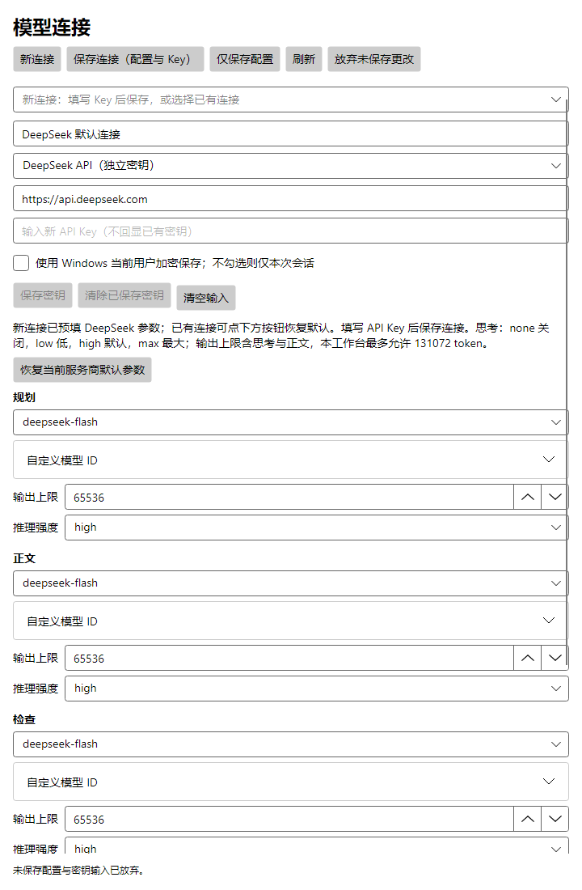
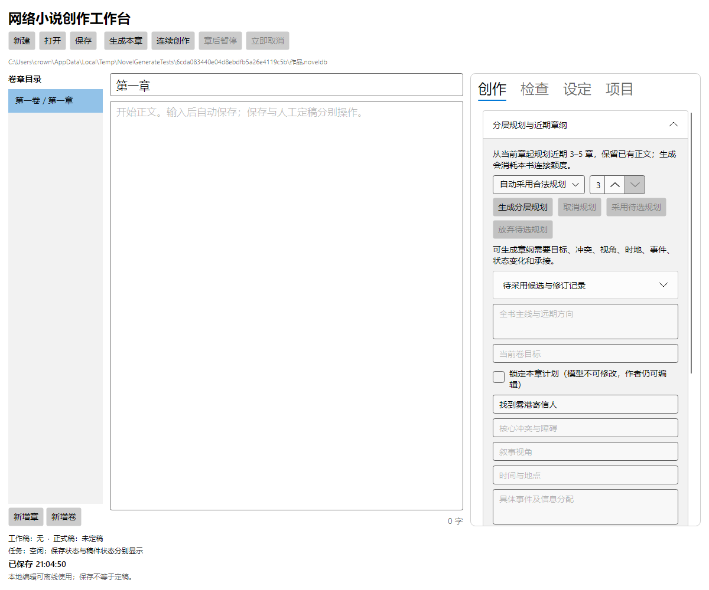
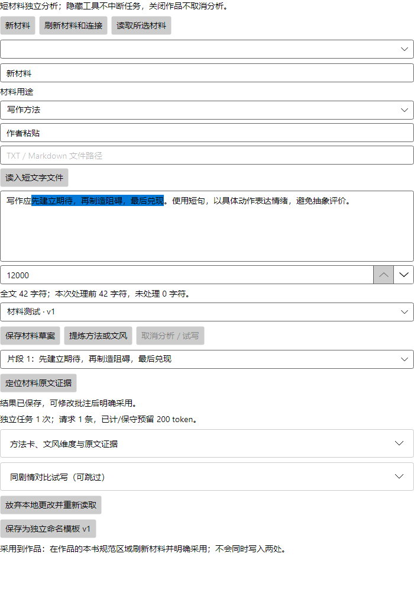
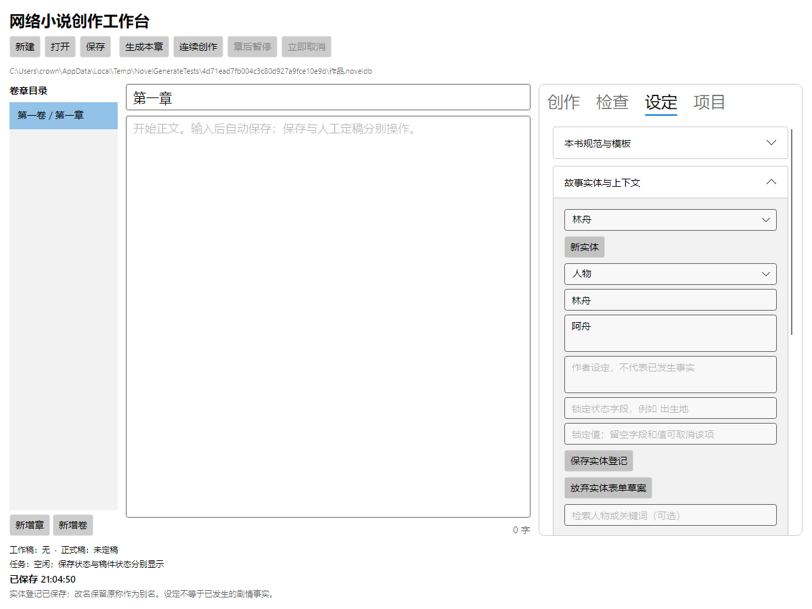
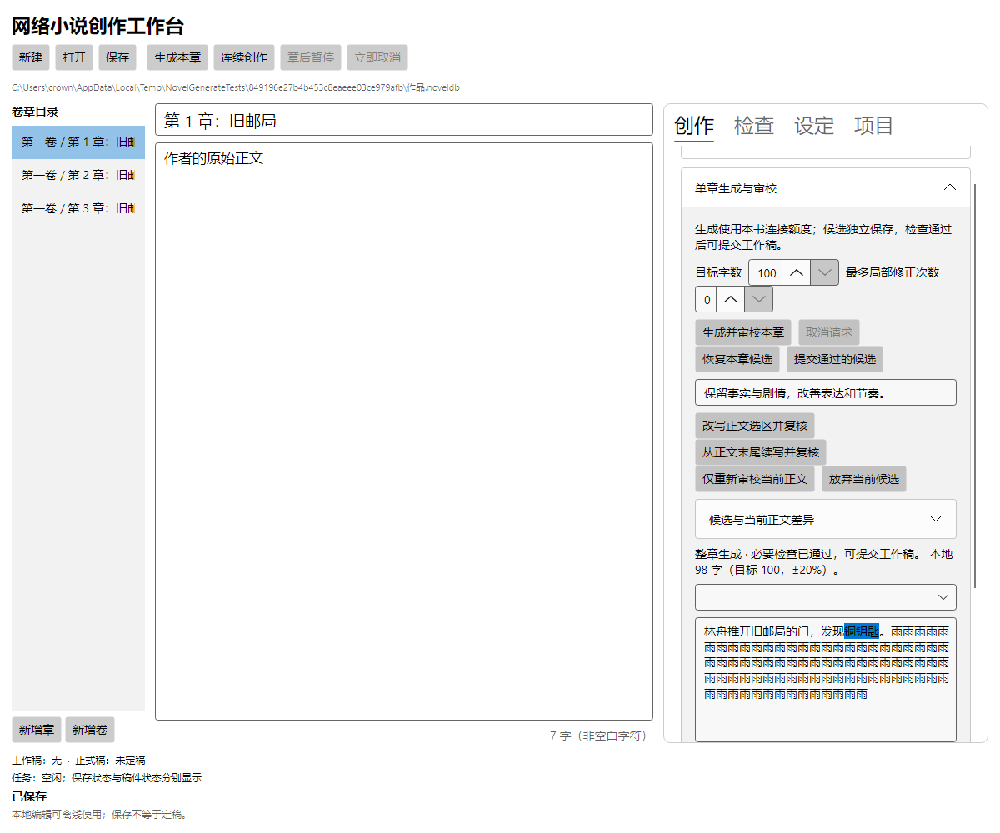
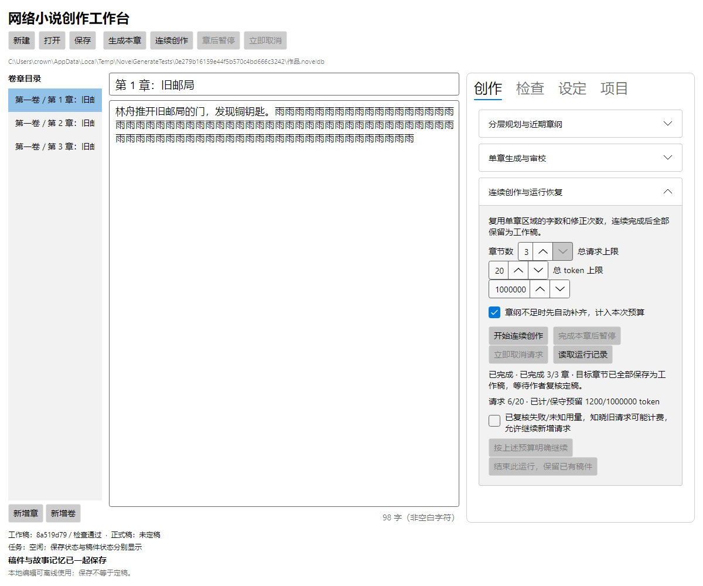
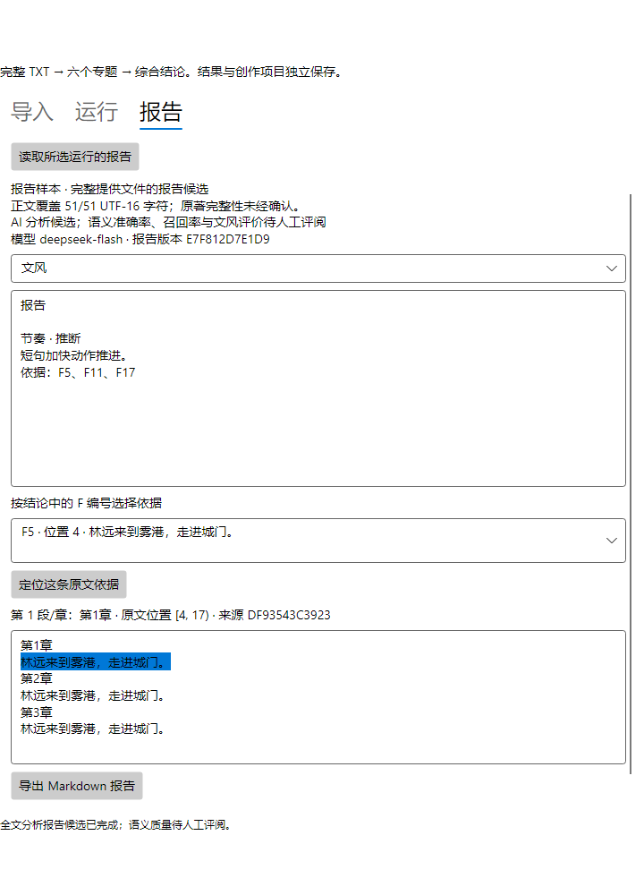

# 网络小说创作工作台 · 用户说明书

适用版本：2026-09-13 工程候选，含 DeepSeek 默认连接及整本 TXT 分析入口。本文按当前可用界面编写，帮助你完成从准备素材到导出正文或分析报告的操作。完整桌面体验和作者质量签收仍在验收中。

## 先选一条适合你的路线

| 你现在的情况 | 从哪里开始 | 最后得到什么 |
| --- | --- | --- |
| 只有一个创意 | 第 2 节：从空白写新小说 | 一份本地作品、近期章纲和可修改的工作稿 |
| 想参考已有小说的表达方式 | 第 3 节：提炼文风与基础设定 | 经自己确认的文风、方法与可复用模板 |
| 已经写了一半 | 第 4 节：接入旧稿并续写 | 按顺序整理的前文、故事记忆与接续章节 |
| 已经有自己的写作要求 | 第 5 节：手工设置 | 一套明确的本书规范与章节场景 |
| 已能生成，想提高效果 | 第 6 节：生成能力与调优 | 可控制范围、检查问题并逐步改进的创作流程 |
| 希望分析一份完整 TXT 小说 | 第 9 节：整本小说分析 | 六个专题、综合结论、原文依据和 Markdown 报告 |

**第一次使用，先完成第 1 节的模型连接，再选路线。** 文档中的流程图是操作说明；截图来自实际 Avalonia 界面的本地验证，截图内的书名、正文、用量与路径是演示数据，不代表你的作品或生成质量。点击截图可放大，按 Esc 返回。

## 1. 认识界面，准备第一次创作

### 你会用到三个入口

打开软件后，进入“小说创作”。独立预览窗口顶部可切换“小说创作”“创作模板库”“模型连接”；在宿主工作台中，它们分别是作品页与两个共享工具页。

**图 1 · 作品工作区。** 左侧切换卷章，中间编辑标题和正文，右侧安排创作任务与设定。底部要分别看“稿件状态”“任务状态”和“已保存”。窄窗口中，点击右上角“创作 / 检查 / 设定”切换正文与侧栏；侧栏内容较长时在侧栏内滚动。

| 位置 | 做什么 | 常用入口 |
| --- | --- | --- |
| 顶部工具条 | 创建、打开、保存作品及控制生成 | 新建、打开、生成本章、章后暂停、立即取消 |
| 创作 | 安排剧情、生成和改写 | 分层规划与近期章纲、单章生成与审校、连续创作与运行恢复 |
| 检查 | 管理规则、检查正文与定稿 | 规则管理与本地检查、本章提纲与修订 |
| 设定 | 告诉模型这本书怎么写 | 本书规范与模板、故事实体与上下文、本书模型连接 |
| 项目 | 备份、导出及找回作品 | 备份与正文导出、最近项目、恢复副本 |
| 创作模板库 | 保存可复用的写作方案 | 模板版本、材料提炼与文风校准 |
| 模型连接 | 配置生成服务 | 保存配置、规划 / 正文 / 检查任务预设 |

### 最快配置：DeepSeek 只填写 API Key

**连接配置图 · 1.0.1 实际界面。** API Key 位于地址下方；规划、正文、检查均预填 deepseek-flash、high、65536。模型和推理强度可下拉选择，不用逐项输入。

1. 打开“模型连接”，点击“新连接”。保留默认名称、地址、模型与推理设置，只输入你的 DeepSeek API Key。
2. 如果需要重启软件后继续使用密钥，勾选“使用 Windows 当前用户加密保存”；不勾选则只在本次会话有效。
3. 点击顶部“保存连接（配置与 Key）”。密钥输入框会清空，原值不会回显。若只想调整模型参数而不改 Key，可点击“仅保存配置”。
4. 回到作品“设定 → 本书模型连接”，刷新并选择该连接，点击“明确绑定此配置”。接下来即可安排章纲与生成。

新连接默认模型为 deepseek-flash，可改选 deepseek-v4-pro；推理选项 none 表示关闭思考，low / high / max 表示开启不同强度。默认 high，单次输出容量 65536 token，包含思考与正文。该容量不等于实际用量，连续创作仍受本轮预算约束。

已有连接保持原值；想改用上述预设，可点“恢复当前服务商默认参数”后保存并在作品中重新绑定。自定义模型 ID 可在对应折叠区填写。更改服务商会重置表单参数并清空未提交 Key；不要把它当作临时浏览其他配置的方式。

这些参数依据 DeepSeek 官方文档填写，协议已用受控请求验证；需要验证你自己的 Key 时，主动点击“生成一句检测（消耗额度）”。没有预置可用密钥。

### 使用 Codex 套餐：填写已登录程序的位置

1. 打开“模型连接”，点击“新连接”，填写容易识别的名称，例如“我的小说连接”。
2. 本次采用 Codex 套餐时，选择“Codex 套餐（已登录 CLI）”，填入本机已登录的 Codex 可执行程序完整路径。路径来自你的实际安装位置，不能照抄截图中的演示路径；若没有已登录程序，需要先完成安装与登录。
3. 选择 Codex 后会预填 `gpt-6-astra`、输出上限 `8192`、推理强度 `high`。本版真实样稿使用过 `low`，对应 CLI 版本为 `0.153.4`；可以在下拉框中调整，具体可用模型以你账户支持的配置为准。
4. 点击“仅保存配置”或“保存连接（配置与 Key）”。Codex 不填写 API Key。若执行单句生成检测，会实际消耗套餐额度；先确认检测结果与用量。
5. 新建或打开作品后，在“设定 → 本书模型连接”点击“刷新连接”，选择刚保存的连接，再点“明确绑定此配置”。看到本书绑定状态后，再开始生成。

**共享连接保存后，本书仍需明确绑定。** 修改连接中的模型、输出上限或其他配置后，也要重新绑定新版本。材料提炼面板有自己的连接选择框，需要另行选择。

DeepSeek 使用独立 API 密钥连接，与 Codex 套餐分开。DeepSeek 默认参数已依据官方文档配置；本版真实样稿通过 Codex 验证，DeepSeek 远端实测仍不属于已完成的验收内容。

离线也可以打开、编辑、保存已有作品。只有生成规划、正文、模型审校、材料提炼、对比试写和连接生成检测等动作需要模型服务；本地规则检查与上下文预览不调用模型。

## 2. 从空白开始写一部小说

### 第一步：创建作品文件

在空白页填写书名、创意与方向，点击“创建本地作品”，选择保存位置。软件创建 `.noveldb` 作品文件，保存正文、卷章、规范和修订记录。先保留这个文件，后续导出的 TXT 只是正文副本。

本教程贯穿使用一个例子：书名《雨夜未寄出的信》；创意“成年邮差林舟在雨夜回到废弃邮局，找到十年前写给自己的信，并决定重新开始写字”。

### 第二步：先确定这本书的边界

在“设定 → 本书规范与模板”填写世界观、文风、方法、长期规则，或先采用一个模板。例子可以从四句话开始：现实世界且没有超自然事件；有限第三人称、表达朴素；先建立期待，再制造阻碍，最后兑现；不进入其他人物内心。

在“故事实体与上下文”登记林舟、旧邮局、旧信等人物、地点、物品。填写作者设定和别名，点击“保存实体登记”。不要把第三章才会发生的事写成开场已经发生。

### 第三步：安排近期章纲

**图 2 · 创作 → 分层规划与近期章纲。** 图中展开了规划面板；本章目标以下还有视角、时地、事件、状态变化、伏笔与承接等字段，需要向下滚动。

1. 选中第一章，打开“创作 → 分层规划与近期章纲”。
2. 初次尝试可选择“协作：预览后采用”，章数设为 3，再点击“生成分层规划”。
3. 展开“待采用候选与修订记录”，核对全书主线、卷目标、三章事件和出场人物。确认方向合适，再点“采用待选规划”；不合适可放弃后调整创意与规范。
4. 若已有明确剧情，也可手工填写主线、卷目标及本章各项计划，再点“保存本章规划修订”。有写作方法时，把方法原文引用和铺设、施压、兑现事件填完整。
5. 确认规划状态提示本章可进入生成。仅在“检查”页写一段提纲，不能替代这里保存的有效规划。

例子的近期安排：第 1 章进入旧邮局，停在发现抽屉；第 2 章找到并读完旧信；第 3 章写回信并收束。把每章的结束位置写清，可以减少提前写完后续剧情的问题。

### 第四步：先生成一章，确认方向

打开“单章生成与审校”，试用目标字数 500、最多局部修正次数 1，点击“生成并审校本章”。先读候选正文与审校报告，再点“提交通过的候选”。看到工作稿状态后，这一章才成为可供后文承接的稿件。

500 字适合小样验证；可以后续调大目标，但本次真实三章实测是短章，不代表长篇质量已经验证。单章结果不喜欢时，可放弃候选、改写选区或重新安排剧情。

### 第五步：让后续章节连续推进

从希望开始的章节进入“连续创作与运行恢复”，设定 3–5 章以及总请求、总 token 上限，确认本次范围再启动。通过检查的章节会自动保存为工作稿。首次也可以直接从第一章连续跑三章；若已完成第一章，改从下一章开始，并安排足够的后续章纲。

连续创作最少为 3 章。如果只剩一两章，请逐章生成；不要为了凑数生成不需要的章节。

### 第六步：审阅、定稿与导出

逐章检查剧情承接和表达，完成修改与复核。在“检查 → 本章提纲与修订”中可“人工定稿本章”，或进入“历史对比、影响清单与连续定稿”，填写起止章、勾选已逐章审阅，再明确整段定稿。

进入“项目 → 备份与正文导出”，选择稿件版本、TXT 或 Markdown、起止章。点击“预览选定稿与检查结果”，阅读提示，再“写入新文件”。完成标志：作品已保存，导出文件中是你选定范围和版本的正文。

## 3. 从已有小说提炼文风与基础设定

### 先了解你会得到什么

这里的“训练风格”是把样文整理成可编辑的写作规范，再用于提示模型。本版不会修改模型参数，也不会把整本小说自动训练成专属模型。

| 想从参考作品得到的内容 | 当前操作 | 需要你确认的部分 |
| --- | --- | --- |
| 句式、节奏、对话、细节表达 | 短样文 → 文风校准 | 提炼是否符合原文，哪些表达适合新书 |
| 铺垫、冲突、悬念、兑现方法 | 短材料 → 写作方法 | 方法是否有原文证据，怎样落到本书事件 |
| 世界背景、能力体系、组织关系 | 手工整理到世界观与实体登记 | 哪些设定沿用，哪些设定重新创作 |
| 已经发生的剧情与人物状态 | 本书正文逐章复核并提交 | 事实是否有正文支持，发生顺序是否正确 |

**文风提炼不会自动导入背景、人物或剧情。** 采用材料结果会更新本书的非空文风、方法字段；它不是把多份材料自动融合成完整知识库。多份材料的结果请自行整理为统一规范，再应用到本书。

### 第一步：挑选有代表性的短片段

选取能体现对白、动作、叙事节奏的片段，保留来源和章节位置。进入“创作模板库 → 材料提炼与文风校准”，点击“新材料”。填写名称、来源，用途选择“文风校准”；分析教程或方法说明时选择“写作方法”。

可以直接粘贴文本，也可以填写 TXT / Markdown 文件路径后点“读入短文字文件”。材料最多 20000 字符，单次分析最多处理前 12000 字符，实际范围以面板“全文 / 本次处理 / 未处理”提示为准。超长内容请先摘取需要的片段；当前没有整本批量分析、自动拆章或 PDF / Word / EPUB 解析入口。

**图 3 · 材料提炼与文风校准。** 图中用途是“写作方法”；分析小说表达时请改选“文风校准”。文本框下面的数字控制本次处理字符数；随后是材料任务使用的连接。结果和 A/B 试写均在下方折叠区。

### 第二步：提炼并核对原文

选择可用连接，点击“保存材料草案”，再“提炼方法或文风”。完成后展开“方法卡、文风维度与原文证据”。点击“定位材料原文证据”，核对概括是否确实来自样文。

把“很有氛围”等抽象结论改成可执行的要求，例如“用触觉和声音建立场景；情绪先通过动作呈现；对白后少解释人物心情”。提炼结果可编辑，修改后保存材料草案。若修改了源文本，应重新提炼；旧分析不再代表新材料。

### 第三步：用同一场景比较效果

展开“同剧情对比试写（可跳过）”，填写试写剧情，例如“林舟在雨夜尝试打开旧邮局的门”。共同事实约束每行一条，例如“林舟没有超自然能力”“场景只有林舟一人”“结尾只进入门内，不读到信”。

点击“生成章纲小样与 A/B 试写”，比较相同剧情下的表达方式。记录采用 A、B 或跳过，并写出修改理由，例如“采用 B 的动作细节，删去末尾感叹”。这会消耗模型额度；选择和批注是创作记录，不会在后台自动训练模型。把最终偏好落实到可编辑的文风要求中并保存。

### 第四步：应用到本书，或保存模板

回到作品“设定 → 本书规范与模板 → 采用材料提炼结果”，点击“刷新已提炼材料”，选择结果，再“只采用到本书规范”。核对本书文风与方法是否符合预期；该操作会替换相应的非空字段，已有自写规范请先保存为模板或备份。

想在其他书使用，可在材料工具中“保存为独立命名模板 v1”。需要包含世界观时，在本书补齐世界观、规则与文风后，使用“本书规范另存模板”。实体列表和正文事实不会因此变成共享模板中的完整故事档案。

完成标志：本书四类规范可阅读、可修改；文风有具体要求；世界背景与人物另行登记；下次生成前，已经按新规范重新确认并保存章纲。

## 4. 接入写到一半的小说，再继续写

### 先区分作品文件与外部正文

已有本软件的 `.noveldb`：点击“打开”，选择作品文件。检查最后几章、连接和待处理运行，先做备份，再接续创作。

已有 TXT、Markdown 或 Word 正文：当前没有“一键导入整本小说并分析”的功能。材料面板的“读入短文字文件”只用于分析参考材料，不会创建作品章节。需要先在原编辑器打开正文，再按下面步骤逐章接入；原稿另行保留。

### 第一步：创建作品，先统一规范

新建本地作品，在“设定”填写既有世界观、文风、长期规则。需要参考原稿表达时，先按第 3 节提炼并采用，再开始前文复核，减少后续改规范导致的反复复核。

登记已有的重要人物、别名、地点、组织和物品。人物出生地等不会变化的设定可以锁定；“第三章刚受伤”属于剧情事实，不宜写成全书固定不变的背景。

**图 4 · 设定 → 故事实体与上下文。** 先“新实体”，选择人物等类别，填写名称和别名后保存。下方可按人物或关键词预览上下文；该预览不调用模型。

### 第二步：按实际顺序放入章节

用现有第一章和“新增章 / 新增卷”建立目录，依次填写标题并粘贴对应正文。等待底部“已保存”。可以先放入所有编辑稿，但复核和提交必须从第一章开始，不要跳到最后一章直接生成。

为每一章在“分层规划与近期章纲”填写与既有正文相符的目标、冲突、视角、时地、事件、状态变化、伏笔与承接，保存规划修订。这是在记录已有剧情，不是让模型重新安排原稿。

### 第三步：逐章分析，建立可信前文

1. 选择第一章，确认本书连接已绑定、实体已登记、章纲有效。
2. 把“目标字数”设到接近该章当前非空白字数的位置。重新审校也执行目标 ±20% 的字数检查；当前目标范围是 100–10000，过短或过长的单章需要先按可用范围整理。
3. 点击“创作 → 单章生成与审校 → 仅重新审校当前正文”。这一操作保留原正文，要求模型检查并生成摘要与事实；它不是整章重写。
4. 阅读报告并处理硬规则、事实或不确定问题；通过后点击“提交通过的候选”，确认正文、摘要和事实一起进入工作稿。
5. 按顺序对第二章、第三章重复操作。未检查工作稿不能直接作为自动续写的有效前文；仅粘贴、保存或普通“提交工作稿”都不等于通过模型复核。

“检查 → 本章提纲与修订”中的手填摘要可以记录你的理解，但不能代替带正文证据的事实复核。本版也不会一次性阅读整部旧稿并自动建立完备的人物关系或全部伏笔档案。

### 第四步：从断点续写

某章只写了一半：在该章章纲写清剩余事件，输入续写要求，再点“从正文末尾续写并复核”。这里从整章末尾追加，不从光标位置接写；目标字数指追加后的整章总字数。通过后比较差异并提交候选。

已完成若干整章：先确认前文工作稿检查有效、编辑稿没有未提交变化，再新增下一章，安排下一章或近期 3–5 章章纲，然后单章生成或连续创作。

已定稿章节要继续修改：先做备份，查看影响清单；处理本轮后续工作稿，必要时“回退本章及后续定稿”，再修改和顺序复核。放弃本轮工作稿影响整轮，回退影响本章及之后的正式状态；历史与编辑文字保留，但不是只撤销一段文字。

完成标志：接续章能够使用有效前文，人物名称与状态没有突然变化，最后一次旧稿事件与新章开头衔接。当前适合可控范围的逐章整理，几十万字旧稿接入需要较多人工工作，尚无长篇自动分析保证。

## 5. 手工设置文风、背景和具体场景

### 四类规范，分别填写

入口：“设定 → 本书规范与模板”。下面是可直接改成你自己故事的填写示例，字段更改会参与自动保存，完成后也可点击顶部“保存”确认落盘。

| 字段 | 回答的问题 | 示例内容 |
| --- | --- | --- |
| 本书世界观与设定 | 故事遵循什么现实与背景？ | 现实世界；旧邮局已经废弃；没有超自然力量；唯一出场人物是成年邮差林舟。 |
| 本书文风 | 读起来是什么感觉？ | 有限第三人称；短句与中句交替；用动作和声音表达情绪；对白简短，少用抽象评价。 |
| 本书写作方法 | 怎样组织期待与冲突？ | 先建立期待，再制造阻碍，最后兑现。 |
| 本书长期规则原文 | 哪些要求需要持续遵守？ | 不写其他人物内心；不凭空增加解决困难的新能力；每章只推进章纲安排的事件。 |

不需要全部靠材料自动提炼。先用少量明确、互不冲突的要求写一章，再补充规范；堆叠大量“必须”和“禁止”可能让生成无法同时满足。

### 把规范落实为本章场景

| 规划字段 | 《雨夜未寄出的信》第一章示例 |
| --- | --- |
| 全书主线与远期方向 | 林舟读到旧信，回应过去的自己，重新开始写字。 |
| 当前卷目标 | 从进入邮局到完成回信，结束这个雨夜的故事。 |
| 本章目标 | 进入旧邮局寻找旧信。 |
| 核心冲突与障碍 | 门锁生锈，随身铜钥匙难以转动。 |
| 叙事视角 | 林舟有限第三人称。 |
| 时间与地点 | 同一雨夜，旧邮局门前。 |
| 具体事件及信息分配 | 尝试钥匙、清理门锁、推门进入；结尾只发现柜台抽屉，不读到信。 |
| 预计状态变化 | 林舟从门外进入邮局；这是计划中的变化。 |
| 伏笔铺设与回收 | 抽屉上熟悉的刻痕，留到下一章解释。 |
| 前后章承接 | 下一章从打开抽屉寻找旧信开始。 |

点击“添加方法应用”：来源原文逐字填“先建立期待，再制造阻碍，最后兑现。”；铺设填“相信旧信还在”，施压填“生锈门锁打不开”，兑现填“门打开并发现抽屉”。保存本章规划修订。必要时勾选“锁定本章计划”，作者仍可编辑，模型需要保持锁定剧情。

### 把具体禁用词做成可检查规则

在“检查 → 规则管理与本地检查”点击“新规则”，填写规则原文、执行解释；例如要避免固定结尾套话，可选择“禁止文本”，在匹配文本填“命运的齿轮开始转动”，范围选“本书”，强度选“硬规则”，勾选启用，再“保存规则版本”。

“匹配文本”是普通文字，不是正则表达式；可选择忽略标点、空白和换行，并按需写例外。点击“检查当前章正文”查看本地命中，点击“选中正文命中位置”定位。像“不要拖沓”这样的语义要求需要模型与作者判断，不能当成固定文字匹配保证。

### 将方案用于下一本书

点击“本书规范另存模板”。在其他作品中“刷新模板”，选择版本，勾选要采用的世界观、文风、方法、规则维度，先“预览采用差异”，再“采用此版本”。只想借用表达方式时，仅勾选文风即可。

每本书保存自己的规范副本；共享模板修改后，不会自动覆盖已有作品。若本书已生成前文，再改规范可能使前文审校和章纲过期，需要先处理影响清单。

## 6. 生成有哪些能力，怎样调优

### 一次完整创作的流程

先确定本书规范与故事实体 → 保存有效章纲 → 核对前文、连接和本次预算 → 生成正文候选 → 模型审校与本地检查 → 必要时有限局部修正并复查 → 保存工作稿 → 作者阅读修改 → 人工定稿 → 导出。

单章生成需要你提交通过的候选；连续创作会自动提交通过章节的工作稿，再进入下一章。出现阻塞问题、预算不足或达到修正上限时停止推进，已经完成的工作稿保留。

**图 5 · 单章生成与审校。** 中间是原正文，右侧是候选和检查入口，方便提交前比较。图中重复文字属于自动化验证用的演示正文，不是实际模型文学样稿；请以自己的候选与报告判断质量。

| 能力 | 适合什么时候 | 操作与结果 |
| --- | --- | --- |
| 生成并审校本章 | 已有章纲，需要完整初稿 | 生成正文后检查规则、事实、剧情方法与文风；候选通过后可提交 |
| 改写正文选区并复核 | 只想改善一段对白或描写 | 在中间正文框选非空片段，填写要求；替换选区后复核整章，提交前对比差异 |
| 从正文末尾续写并复核 | 当前章尚未完成 | 填写剩余剧情要求；保留既有正文，在整章末尾追加，再复核整章 |
| 仅重新审校当前正文 | 手写稿、粘贴旧稿或人工改稿 | 不先生成替换正文；检查当前文字并形成摘要、事实候选 |
| 自动局部修正 | 整章生成后有可局部修复的问题 | 最多 0–2 次，默认 1；修改过大或定位不明确会停止，留给作者处理 |
| 连续创作 | 想生成近期一批章节 | 每批 3–5 章，共用请求与 token 上限；通过后逐章保存工作稿 |
| 读取记录与恢复候选 | 中断后希望找回结果 | 恢复查看已保存候选或运行记录；不会仅因打开记录就自动开始新请求 |

改写、末尾续写与仅复核不会自动套用整章生成的局部修正循环。遇到问题请根据报告调整后重新发起；每次模型操作都可能产生新的用量。

### 参数怎样影响结果

| 参数 | 控制什么 | 如何设置与调整 |
| --- | --- | --- |
| 目标字数 | 整章期望长度 | 范围 100–10000，默认 2000；本地按非空白字符计数，含标点，接受目标 ±20%。续写和改写也看整章总长度 |
| 最多局部修正次数 | 整章生成的自动返修上限 | 0 不自动返修，1 为默认，最多 2；增加次数会增加请求，不保证解决结构性剧情问题 |
| 规划章数 / 连续章数 | 本次需要安排与生成多少章 | 每次 3–5 章；先验证一章方向，再扩大范围 |
| 总请求上限 | 连续运行允许多少次模型请求 | 正文、审校、修正和补章纲都会占用，不是“章数”；预算耗尽会停止 |
| 总 token 上限 | 连续运行用量边界 | 包含输入与输出，未知用量按保守预留处理；不是正文汉字数，也不是价格或余额显示 |
| 模型输出上限 | 单次模型响应可输出的容量 | 在“模型连接”设置。正文过长或审校报告复杂时可能被截断；调大后保存并重新绑定，仍须账户与模型支持 |
| 推理强度 | 传给模型的思考设置 | DeepSeek 下拉 none / low / high / max，默认 high；Codex 下拉 low / medium / high。它不是文风旋钮，不能替代明确章纲 |

**上下文预览里的容量只控制预览。** “设定 → 故事实体与上下文”的关键词、包含工作稿和容量用于本地查看；不要把增大这里的数字理解为生成请求一定会携带更多历史。生成服务按自己的上下文规则组织有效前文。

### 用一章做可比较的调优

1. 固定同一章事件、目标字数、模型和共同事实约束，先读当前候选。
2. 写下一个具体问题，例如“开门用了太多心理解释”，不要只写“更好看”。
3. 只改一个维度：在改写要求中写“保留开门事件，删去心理解释，改用手部动作与门锁声表达犹豫”。
4. 生成后打开“候选与当前正文差异”，检查事件、人物事实和节奏；看问题证据，再决定采用。
5. 把有效经验写回本书规范或模板；若改变长期规范，先处理旧审校过期提示，再安排下一批。

| 看到的问题 | 优先改哪里 | 示例做法 |
| --- | --- | --- |
| 文字空泛、情绪全靠解释 | 本书文风 / 选区改写要求 | 指定动作、声音、物件细节；删去重复心理总结 |
| 一章把后续剧情全写完 | 本章事件与信息分配 / 承接 | 明确“本章只发现抽屉，不打开信” |
| 人物称呼和能力不一致 | 实体登记、别名、锁定设定 / 有效前文 | 统一名称，补齐人物能力边界，先复核矛盾前文 |
| 反复出现某句套话 | 规则管理 | 新建具体的禁止文本规则；不要只依赖口头风格要求 |
| 太长或太短 | 目标字数 / 章纲事件数量 | 目标与剧情体量匹配；检查整章非空白字数是否在容差内 |
| 输出被截断 | 模型输出上限 / 本次内容规模 | 减少篇幅或提高支持的输出容量，保存并重新绑定后再试 |
| 反复返修仍不通过 | 规则冲突 / 事实证据 / 场景结构 | 先读阻塞原因，手工解决矛盾；不要只增加预算和修正次数 |

### 连续生成、暂停与恢复

**图 6 · 连续创作与运行恢复。** 顶部设定范围和预算，中部控制开始、暂停、取消，底部显示运行用量与恢复确认。图中数字和正文来自测试场景，不是套餐推荐额度。

“章纲不足时先自动补齐，计入本次预算”适用于愿意让系统先规划的运行；若希望完全按自己的计划推进，先准备好章纲并关闭该选项。开始前确认当前选中的章节就是本次起点。

“完成本章后暂停”会让本章完成保存后停下；“立即取消请求”会取消当前请求，可能留下未完成候选，不能把这段当成已通过工作稿。重新打开后点击“读取运行记录”，先核对进度和用量，再按页面提示明确继续。

失败或未知用量不等于没有消耗。确认原因后，按需勾选“已复核失败/未知用量……”并“按上述预算明确继续”。不再继续时，点“结束此运行，保留已有稿件”。

本版真实短篇实测：三章分别为 487、498、477 个非空白字符，共 6 次请求、90187 token，没有局部返修。这是一次验证记录，包含 Codex 运行上下文开销，不能按此承诺以后每章的速度、用量或质量。

## 7. 保存、候选、工作稿与正式稿

| 你看到的状态 | 表示什么 | 下一步 |
| --- | --- | --- |
| 已保存 | 当前作品编辑已写入本地文件 | 可以继续编辑；不代表已通过审校或定稿 |
| 候选 | 一次生成、改写或复核的结果 | 阅读正文和检查报告；通过后提交，或放弃采用 |
| 工作稿 / 检查通过 | 已提交且有当前有效的审校结果 | 可用于后续承接；作者仍应审阅 |
| 工作稿 / 未检查 | 人工提交的稿件，还没有模型检查证明 | 自动续写前按流程复核，不把它当作检查通过 |
| 正式稿 | 作者明确选定的修订 | 作为正式版本导出；修改需处理回退和后续影响 |

手工定稿表达作者决定，不会凭空补出模型审校证明。若你跳过模型复核，导出或后续流程可能仍显示相应提示。

本地输入自动保存，顶部也有“保存”。长时间创作、接入旧稿或大改前文之前，可以在“项目”点击“一致性备份本书”。恢复时用“从备份恢复到新文件”，保留原项目进行核对。

导出要明确选择“编辑稿”“工作稿视图”或“正式稿”，再选 TXT / Markdown 与范围。已有同名目标文件不会被覆盖，请使用新文件名。需要继续在软件中编辑和保留历史时，保留 `.noveldb`；仅有 TXT 不能还原完整项目。

## 8. 遇到问题，先检查这里

| 现象或提示 | 先检查 | 再怎么做 |
| --- | --- | --- |
| 生成按钮不可用或没有开始 | 是否创建作品、绑定连接、选中章节，是否正在执行其他任务 | 看底部任务与提示；等待当前任务结束或明确取消 |
| 章纲尚未准备好 | 本章各项计划、全书主线、卷目标和方法引用是否齐全 | 到“创作”保存本章规划修订；不要只填“检查”页的自由提纲 |
| 前文尚无有效稿件 / 未通过检查 | 是否只粘贴保存，或只提交了未检查工作稿 | 从第一处缺失章节开始，顺序复核并提交通过候选 |
| 前文有未提交修改 / 审校过期 | 是否改了正文、规范、章纲或前文 | 查看影响清单，处理后续依赖，按顺序重新复核 |
| 后续已有工作稿 | 正在回改前文，而后面已有本轮结果 | 先备份，明确处理本轮工作稿；正式稿按需回退，再重建有效前文 |
| 候选通过后却不能提交 | 生成后是否又改动了正文或规范 | 基于最新内容重新复核；旧候选不能覆盖更新后的编辑稿 |
| 材料列表看不到结果 | 材料是否已保存、分析是否与当前源文一致 | 保存或重新提炼，再在作品中刷新已提炼材料 |
| 连接失败 / 认证错误 | Codex 是否已登录、路径是否存在、模型是否可用 | 修正连接并保存、重新绑定；不要反复盲目点击收费生成 |
| 预算不足或用量未知 | 本轮已发生与预留请求量 | 读取记录，核实后明确调整预算与继续；已保存章节会保留 |
| 保存失败 | 文件位置是否可写、是否被占用，以及软件的恢复提示 | 保留原作品与恢复副本；处理路径问题后保存，或从恢复列表恢复到新项目 |

本版提供短材料、近期章纲、可控范围的连续创作，以及独立 TXT 分析报告。把参考报告自动变成创作模板、外部小说批量转成创作章节和长期完整知识库仍属后续范围。

使用本软件最稳妥的节奏是：先把一章写到愿意继续读，再让下一批章节沿着同样明确的规范推进。

## 9. 整本小说分析：从 TXT 到综合报告

在“创作模板库”展开“整本小说分析”。不需要先创建创作项目。这个入口有“导入”“运行”“报告”三个页签，来源和分析记录会自动保存在本机工作区。

1. 在“导入”选择 TXT，点击“预览全文”。核对编码、字符数、分章清单和段落文字；乱码时切换编码再预览。较长章节会继续切块，不能把预览窗口只显示部分文字误认为只分析这一部分。
2. 点击“确认导入”。保存的是刚才预览的完整来源快照；此后原 TXT 删除或移动也不影响已保存来源。
3. 在“运行”选择参考小说、已有模型连接，核对请求和 token 总额，点击“开始新的全文分析”。使用连接的检查预设，所有提取、跨章整合、汇总、专题和综合请求都计入同一预算。
4. 查看正文覆盖、节点明细和实际用量。隐藏工具或切换书目不取消任务；“暂停”在当前完整结果保存后停止，“取消”会中止当前请求并保留账本。退出软件时也会排空并保存检查点。
5. 需要继续时，选中原运行，读取进度后“继续运行”。失败或未知用量需要先“查看当前失败候选”，核对原因和费用，再勾选复核确认；可填写针对失败的补充约束。改变连接或切分时使用“按当前连接和切分新建修订”，累计费用保留。
6. 到“报告”读取所选运行，切换六个专题或综合结论。每条结论列出 F 编号，选择对应依据并点击“定位这条原文依据”，可查看来源附近文字和高亮选区。
7. 点击“导出 Markdown 报告”，选择新文件名。报告包含结论、短引文、位置、来源哈希、覆盖和质量限制；已有同名文件不会覆盖。

**图 7 · 实际 Avalonia 报告界面。** 图片使用本地合成测试文本，展示原生控件和高亮定位。真实提供文件已验证 51071 个 UTF-16 字符、20 个提取单元、六专题与综合报告；百万字符真实小说和人工准确性验收仍待补充。

“完整”表示提供文件的必需处理节点齐全，并不证明原文件包含整部原著，也不代表语义准确率已经通过。报告会区分明确、推断、不确定，并列出未解决问题。短篇样本的用量不能直接外推到长篇或作为价格承诺。

默认预算只是可修改的初始值。新任务先为整合与报告保留 32 次请求和 1200000 token，实际需要随内容密度增加；总额不足时会暂停。未知用量按保守预留计算，不当作零；本界面不显示未经核实的货币费用。

“复核采纳已有候选”用于本地校验规则修正后重新验证同一完整响应。只有输入版本一致、用量已知且当前契约通过时才可采纳；它不会修补错误 JSON、采纳截断文本或代替人工判断。

### 9.1 模型失败时怎样处理

新版会区分格式定义回显、结构字段错误、输出达到限制、响应流中断与费用不足。格式错误会尽量显示字段位置；消息中不展示密钥、推理或服务端原始错误正文。

响应完整且用量已知时，同一节点最多自动纠正一次，沿用累计预算并保留原费用；再次失败则暂停。中断、未知费用和输出截断不会当作普通格式错误反复发送。查看候选并复核费用后，可以继续原运行，已完成节点不会重新执行。

Gaps 中可选的证据会核对来源；增加 token 总预算不能解决字段或 JSON 格式错误。已收到用量后再发生断流，也会保留这些计数；缺失用量仍按保守预留展示。

### 9.2 分阶段参数和保留进度的修订

在“运行 → 分析专用参数”设置五个阶段的模型、思考强度和单次输出上限。这些参数不修改创作连接；不勾选时使用原检查预设。DeepSeek 默认提取/汇总使用 none、16384，整合/专题/综合使用 high、32768，可按实际内容调整。

“继续运行”使用原运行配置；修改参数后点击“按当前连接和切分新建修订”才采用新参数。范围不变的成功节点保留原参数和结果，未完成节点使用当前参数；节点明细和导出报告会列出实际配置。改变切分会让受影响节点及其下游重新计算，全部历史费用仍计入同一预算。

首次打开旧运行库会先生成本机 Backups 备份再升级格式。需要回退旧插件时，应同时恢复匹配的运行库备份。

### 9.3 单次容量和问题单元拆分

“全过程 token 上限”管累计用量，“单次输出上限”管本阶段一次回答的预留，“单次上下文容量”检查这次输入与输出能否容纳。增加全过程预算不能解决 JSON 字段错误、断流或单次容量不足。

在“分析专用参数”中，单次上下文容量填 0 会识别已知模型；其他模型可填写服务商给出的容量。估算采用保守算法，页面会区分输入估算与实际用量。填写更大的数字不会扩大模型窗口，也不建议为了越过提示而虚填。

默认最多拆分 3 层，填 0 关闭自动拆分。输入预检装不下，或模型明确因长度截断且用量已知时，系统只把问题提取单元分成两份继续，每份至少 200 字符；前面成功成果保留。原文正文不漏不重，辅助上下文可重叠。每次拆分和旧费用都会保存，暂停重开后接着处理子单元。

未知费用、响应流中断或取消不会自动拆分。达到深度、最小单元或预算边界时暂停，保留后续报告额度。需要调整设置时新建修订；不要靠重复点击继续来排除错误。

对已有失败运行，先读取进度和候选：完整格式错误可按提示复核；未知用量仍需要复核额外成本。若要采用新的分阶段默认值，勾选分阶段参数后新建修订，未完成节点使用新设置，成功节点仍保留原配置和成果。本次修复的验证范围见[稳定性修复进度](../analysis-reliability-plan.md)。
